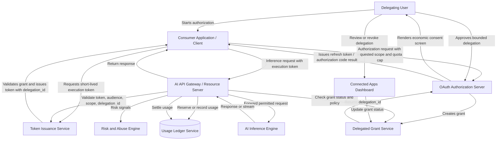

# Technical Review of the AI Billing Delegation Standard (ABDS)

**Document Reference:** ABDS-REV-2026-06  
**Status:** Formal Architecture Review / Standards Contribution  
**Audience:** Software Architects, Standards Reviewers, AI Provider Platform Teams, Academic Reviewers  

---

## 1. Executive Summary

The AI Billing Delegation Standard (ABDS) addresses a material economic and architectural bottleneck in the consumer AI ecosystem: resource-provisioning friction. Today, third-party developers building consumer applications on foundation-model APIs must generally choose between absorbing volatile inference costs, engineering internal credit systems, or forcing users into high-friction Bring Your Own Key (BYOK) flows. ABDS proposes a standardized mechanism by which a user can authorize bounded third-party consumption of AI resources associated with their own provider account or subscription.

From an architectural standpoint, ABDS is technically plausible and worth further standardization work. Its central value is not merely billing convenience; it is the introduction of an explicit, revocable, provider-enforced delegation layer for metered AI resource usage.

ABDS should not be developed as a standalone proprietary protocol. The strongest standards posture is to define ABDS as an **OAuth 2.0 profile** that reuses existing OAuth and OpenID Connect concepts where possible, especially:

- OAuth 2.0 Authorization Code Flow with PKCE
- OAuth 2.0 Token Exchange
- OAuth 2.0 Resource Indicators
- OAuth 2.0 Token Revocation
- OAuth 2.0 Token Introspection patterns where applicable
- Existing consent-screen and connected-app management conventions

This positioning gives ABDS a better chance of being taken seriously by identity engineers, API platform teams, and standards reviewers.

---

## 2. Core Architectural Strengths

The current ABDS architecture has several strong design choices.

### 2.1 Separation of Token State from Quota State

ABDS correctly separates the short-lived execution token from live quota state. Volatile usage values such as `quota_used`, `quota_remaining`, `quota_cap`, `quota_period`, and `quota_reset` should not be embedded in bearer-token claims.

Mutable quota state belongs in provider-side grant records and usage ledgers, exposed through a provider-authoritative Usage Introspection Endpoint. This avoids stale claims, replay inconsistencies, distributed race conditions, and cache-invalidation failures.

### 2.2 Provider-Authoritative Ledger Model

The provider-side usage ledger is the right enforcement authority. Client-side counters, locally cached quota values, or token-embedded quota claims are insufficient for a metered economic resource. The provider must be able to enforce caps atomically, audit usage, detect abuse, and revoke or suspend delegations.

### 2.3 Short-Lived Execution Tokens

Short-lived execution tokens reduce the blast radius of token leakage. ABDS should continue to treat these tokens as execution credentials, not entitlement records. The token should identify the subject, client, issuer, audience, scope, token identifier, version, and `delegation_id`; it should not carry live economic state.

### 2.4 Elimination of Consumer BYOK

ABDS avoids exposing raw API keys to ordinary consumers. That is a major usability and security improvement. BYOK remains useful for developer tools and power-user workflows, but it is not a credible mainstream consumer pattern.

---

## 3. OAuth 2.0 and OIDC Alignment Mapping

To improve interoperability, ABDS should map its concepts to established OAuth terminology and standards.

| ABDS Component | Established Standard / Pattern | Recommended Treatment |
| :--- | :--- | :--- |
| Initial app authorization | OAuth 2.0 Authorization Code Flow with PKCE | SHOULD be the default for web, native, and mobile clients. |
| Long-lived user approval | OAuth refresh token with rotation | SHOULD be used where the provider supports long-lived delegation. |
| Execution token issuance | OAuth 2.0 Token Exchange | SHOULD be considered for minting short-lived downstream execution tokens from a long-lived delegated grant. |
| Target AI API | OAuth 2.0 Resource Indicators | SHOULD be used to bind authorization to the target AI resource server or API gateway. |
| App registration | Dynamic Client Registration / developer-console registration | MAY be used depending on provider maturity and risk model. |
| Revocation | OAuth Token Revocation and provider connected-apps dashboard | MUST be supported for user-controlled withdrawal of delegation. |
| Introspection | Token introspection patterns plus ABDS-specific usage introspection | SHOULD be clearly separated: token validity is not the same as quota state. |

### 3.1 Nomenclature Realignment

For standards credibility, ABDS should use OAuth-aligned terminology where possible:

- **AI Provider** should be decomposed conceptually into:
  - **Authorization Server (AS):** handles user authentication, consent, grant creation, token issuance, and revocation.
  - **Resource Server (RS):** handles AI inference API requests and enforcement at the API gateway.
- **Third-Party App** should be described as the **Client**.
- **Execution Token** can be described as an **Access Token issued under the ABDS delegation profile**.
- **Delegated AI Grant** should remain as the ABDS-specific server-side grant object, because OAuth does not already define this exact economic delegation object.

---

## 4. High-Throughput Reference Architecture

A provider-scale ABDS implementation should decouple authorization, grant state, token issuance, gateway enforcement, usage accounting, and abuse detection.



### Component Breakdown

**OAuth Authorization Server (AS):** Authenticates the end user, renders the consent screen, creates the delegated grant, issues authorization codes, supports token exchange, and handles revocation.

**Delegated Grant Service:** Maintains the provider-side grant record, including `delegation_id`, `user_id`, `app_client_id`, quota cap, quota period, model scope, grant status, and lifecycle timestamps.

**Token Issuance Service:** Issues short-lived execution tokens that reference the delegated grant through `delegation_id`. Tokens should be audience-restricted and scoped.

**AI API Gateway / Resource Server:** Validates execution tokens, resolves the delegated grant, enforces model scope and rate limits, coordinates with the usage ledger, and forwards authorized requests to the inference engine.

**Usage Ledger Service:** Records consumption events, reservation holds, settlement events, quota resets, and audit receipts.

**Risk and Abuse Engine:** Detects anomalous delegation and usage patterns, including quota farming, consent phishing, token replay, and high-velocity delegated usage.

**Connected Apps Dashboard:** Gives users visibility into active delegations, quota caps, usage consumed, reset periods, developer identity, and revocation controls.

---

## 5. Consent Screen and User Trust Requirements

ABDS consent is not ordinary profile-data consent. It authorizes consumption of a metered economic resource. The consent screen must therefore communicate consequence, not merely permission.

### Required User-Visible Fields

The consent screen should display:

- The verified application name.
- The verified developer or organization domain.
- The requested quota cap.
- The quota period or reset interval.
- The model class or model family requested.
- Whether the delegation renews automatically.
- Whether the application can perform streaming, multimodal, batch, or agentic tasks.
- A plain-language explanation of how the delegation affects the user's AI allowance.
- A clear revocation path.
- A high-visibility warning for unverified apps.
- A stronger review or step-up flow for high-quota, high-risk, or sensitive model scopes.

### Example Consent Wording

> Allow **Translation Studio** by **example.com** to use up to **500,000 standard text units per month** from your AI provider account.  
> This app will not see your password or API key. You can revoke this access at any time from Connected Apps.  
> This authorization does not allow the app to exceed the usage cap shown here.

The wording should avoid abstract billing terminology where possible. Ordinary consumers need to understand what they are authorizing.

---

## 6. Token Design and Cryptographic Hardening

Execution tokens should be short-lived, audience-restricted, and scoped to the relevant AI resource server. They should identify the delegated grant but should not carry quota-limit or quota-consumption metadata.

### Example Execution Token Claims

```json
{
  "iss": "https://auth.aiprovider.com",
  "sub": "usr_948201842",
  "aud": "https://api.aiprovider.com/v1/inference",
  "exp": 1780842000,
  "iat": 1780841100,
  "jti": "b0a2c3d4-e5f6-7a8b-9c0d-1e2f3a4b5c6d",
  "client_id": "app_translation_studio_prod",
  "delegation_id": "del_883019481a7b",
  "scope": "ai.inference.generate",
  "model_scope": ["standard-text-only"],
  "abds_version": "0.2"
}
```

### Required and Recommended Properties

- `iss` MUST identify the authorization server.
- `aud` MUST identify the intended AI resource server or API gateway.
- `exp` MUST define a short token lifetime.
- `jti` SHOULD be included for replay detection and audit correlation.
- `client_id` SHOULD identify the client application.
- `delegation_id` MUST reference the server-side delegated grant.
- `model_scope` SHOULD be represented consistently with the main specification, preferably as an array.
- `quota_used`, `quota_remaining`, `quota_cap`, `quota_period`, and `quota_reset` MUST NOT appear in the execution token.

### Proof-of-Possession Tokens

ABDS providers SHOULD support proof-of-possession mechanisms such as DPoP for higher-risk integrations. Providers MAY require DPoP for public clients, high-quota delegations, elevated model tiers, suspicious clients, or regulated environments.

DPoP should not be mandatory for all ABDS implementations in the initial draft. Making it universally mandatory could raise implementation cost and slow adoption. It is better treated as a risk-based hardening mechanism.

---

## 7. Usage Introspection and Ledger Semantics

The Usage Introspection Endpoint should remain the authoritative source for delegated quota state. It should report provider-side ledger state, not token claims.

A minimal response should include:

```json
{
  "delegation_id": "del_883019481a7b",
  "status": "active",
  "quota_cap": 500000,
  "quota_used": 125000,
  "quota_remaining": 375000,
  "quota_period": "monthly",
  "quota_reset": "2026-07-01T00:00:00Z",
  "model_scope": ["standard-text-only"]
}
```

ABDS should distinguish between two concepts:

1. **Token introspection:** Is this token valid, unexpired, correctly scoped, and intended for this audience?
2. **Usage introspection:** How much delegated quota remains, what grant status applies, and what accounting constraints govern this request?

These should not be conflated.

---

## 8. Quota Reservation for Streaming and Agentic Calls

AI usage differs from traditional API usage because the final cost of a request may be unknown at request start. Streaming responses, multimodal calls, batch jobs, and agentic tool-use workflows can consume resources unpredictably.

ABDS v0.2 should not mandate a full reservation protocol. However, ABDS v0.3 should define an optional reservation/settlement profile for high-cost or long-running workloads.

### Recommended Model by Workload

| Workload Type | Recommended Accounting Model |
| :--- | :--- |
| Short non-streaming call | Deduct on completion or near-completion. |
| Streaming response | Reserve estimated maximum at start, settle actual usage on completion. |
| Long-running agent task | Reserve per step or per budget window, settle incrementally. |
| Batch job | Require preflight estimate and explicit reservation before execution. |
| Multimodal generation | Provider-defined estimate with reservation and final settlement. |
| Tool-use workflow | Budgeted execution envelope with stepwise settlement. |

### Reservation-Settlement Pattern

A future ABDS reservation profile could define the following flow:

1. **Preflight Estimate:** The client or gateway estimates maximum resource consumption.
2. **Reservation:** The provider places a temporary hold against delegated quota.
3. **Execution:** The inference request runs or streams.
4. **Settlement:** The provider records actual usage against the ledger.
5. **Release:** Unused reserved quota is released back to the delegation.
6. **Receipt:** The provider emits an auditable usage receipt.

### Failure Handling

A reservation profile should define handling for:

- Client disconnect.
- Provider timeout.
- Partial generation.
- Retry after partial completion.
- Exceeded reservation.
- Tool-call loops.
- Stream cancellation.

If a request cannot be reserved because delegated quota is insufficient, the provider should return `HTTP 429` with an ABDS quota-related error such as `abds_quota_exceeded` or a future `abds_reservation_insufficient`. `HTTP 402` should remain reserved for subscription or payment-state failures, such as `abds_subscription_lapsed`.

---

## 9. Formal Threat Model and Mitigations

| Threat Category | Vulnerability | Consequence | Recommended Mitigation |
| :--- | :--- | :--- | :--- |
| Token replay | Execution token stolen from logs, proxies, or compromised backend. | Attacker consumes delegated quota. | Short token lifetime, audience restriction, `jti`, anomaly detection, and optional or risk-required DPoP. |
| Quota laundering | Malicious app aggregates many consumer delegations and resells access. | Consumer subscription tiers become backdoor wholesale API supply. | Per-client/user velocity limits, app verification, quota ceilings, resale detection, and provider-side revocation. |
| Consent phishing | App uses deceptive name or branding. | Users authorize malicious consumption. | Verified developers, warnings for unverified apps, brand review, and high-risk consent friction. |
| Backend proxy abuse | Attackers hammer the consumer app backend. | Delegated quota drains through legitimate app infrastructure. | Client-side and backend rate limits, bot detection, abuse scoring, and per-delegation throttles. |
| Prompt-injection quota exhaustion | Malicious content causes agentic loops or expensive tool use. | Unexpected quota depletion. | Budget caps, tool-call limits, stepwise settlement, and user-visible usage receipts. |
| Bot-created delegations | Automated accounts create delegations for abuse. | Provider resources consumed at scale. | Account trust scoring, step-up verification, velocity limits, and fraud detection. |
| Model laundering | Consumer delegations used to access models for unauthorized commercial workloads. | Provider pricing tiers are bypassed. | Model-scope restrictions, enterprise-feature exclusions, and suspicious aggregation detection. |

---

## 10. Client Integration Architecture

Consumer-facing applications should avoid exposing ABDS execution tokens or refresh tokens to browser or mobile runtimes.

### Backend-Mediated Token Handling

Consumer-facing web applications SHOULD use a backend-mediated token-handling pattern, such as Backend-for-Frontend (BFF), where sensitive tokens are stored server-side and the browser receives only an opaque, secure session cookie.

Recommended pattern:

1. The browser authenticates to the consumer application.
2. The consumer application stores ABDS refresh tokens server-side in encrypted storage.
3. The browser receives only an opaque session identifier in an `HttpOnly`, `Secure`, `SameSite=Lax` or `SameSite=Strict` cookie, depending on the OAuth redirect and application flow.
4. When the user triggers an AI action, the browser calls the application's backend.
5. The backend performs token exchange or refresh with the AI provider.
6. The backend sends the short-lived execution token only to the provider API gateway.
7. The backend streams or returns the AI response to the browser.

This pattern avoids placing high-value economic credentials in `localStorage`, `sessionStorage`, JavaScript-accessible cookies, or mobile client storage.

---

## 11. Compatibility With Google-Style Platform Patterns

ABDS has useful analogies in public Google-style platform patterns, but no single existing pattern fully solves the ABDS problem.

### Google Sign-In

Google Sign-In demonstrates mainstream user acceptance of OAuth-based third-party authorization. ABDS can learn from its familiar account-selection and consent UX. However, Google Sign-In generally delegates identity and profile access, not consumption of a metered economic AI resource.

### Workspace OAuth Consent

Workspace OAuth consent screens are a strong analogy for sensitive scopes, verified apps, restricted scopes, and admin controls. ABDS should borrow the idea that higher-risk delegated access requires stronger review, clearer warnings, and possibly organizational policy controls.

### Google Cloud IAM and Service Accounts

Cloud IAM and service accounts show how permissions can be delegated with precise roles and auditability. However, ABDS is user-consent-driven and subscription-entitlement-driven, not primarily infrastructure-identity-driven. The analogy is useful but limited.

### Quota Projects

Google Cloud quota-project patterns are relevant because they separate the caller from the project against which quota or billing may be counted. ABDS introduces a related but distinct consumer pattern: a third-party application consumes against a user-authorized delegated AI grant rather than a developer-owned billing project.

### Cloud Billing Export

Cloud Billing export demonstrates the value of detailed accounting and downstream audit pipelines. ABDS should similarly provide usage receipts, ledger exportability, or audit logs for provider and user trust.

### Marketplace Billing

Marketplace billing suggests a future direction where ABDS could support provider-approved commercial integrations, paid delegated add-ons, or revenue-sharing channels. That should remain future work, not a v0.2 requirement.

### Domain-Wide Delegation

Domain-wide delegation is relevant for enterprise-managed access, but it is not the same as consumer ABDS. Enterprise ABDS may require a separate profile for organizational grants, admin policy, and delegated employee usage.

---

## 12. Provider Economics and Adoption Strategy

A serious provider objection is that ABDS could cannibalize developer API revenue. If developers can consume user subscription quota instead of paying API invoices, the provider may appear to lose incremental revenue while increasing inference load.

That objection is credible, but incomplete.

Many consumer AI developers are not choosing between paying API invoices and using ABDS. They are choosing between:

- not launching,
- limiting functionality aggressively,
- creating fragile credit systems,
- forcing BYOK,
- risking financial exposure,
- or avoiding AI-heavy use cases entirely.

ABDS can expand the market by making consumer AI applications economically deployable. Providers can preserve economic control by defining bounded delegated allowances separate from the user's full subscription entitlement. They can exclude premium models, cap monthly delegated usage, require app verification, offer paid delegated add-ons, and reserve enterprise-grade throughput for dedicated API customers.

The strategic upside is ecosystem capture. The first major AI provider to support ABDS would become the easiest platform for consumer AI developers to build on. That developer loyalty may be more valuable than marginal API revenue from small developers reluctantly absorbing unpredictable costs.

---

## 13. Spec Integration Guidance

The following recommendations should be treated differently depending on maturity and implementation cost.

### MUST

- Keep quota consumption and quota-limit metadata out of execution tokens.
- Maintain provider-authoritative grant and ledger state.
- Provide revocation and connected-app management.
- Enforce quota caps server-side.
- Use short-lived, audience-restricted execution tokens.
- Provide a Usage Introspection Endpoint.

### SHOULD

- Align terminology with OAuth Authorization Server, Resource Server, Client, Access Token, and Grant concepts.
- Support Authorization Code Flow with PKCE.
- Support refresh token rotation for long-lived delegations.
- Use token exchange patterns for downstream execution tokens.
- Use resource indicators to bind tokens to the AI API gateway.
- Provide app verification and unverified-app warnings.
- Use backend-mediated token handling for browser-based consumer apps.
- Support proof-of-possession mechanisms such as DPoP for high-risk clients or high-quota delegations.

### MAY

- Support Dynamic Client Registration.
- Support marketplace-style provider review for high-volume ABDS apps.
- Support enterprise or organization-scoped ABDS profiles.
- Provide detailed user-facing usage receipts.

### FUTURE WORK

- Reservation and settlement profile for streaming, multimodal, batch, and agentic workloads.
- Enterprise ABDS profile for organizational subscriptions.
- Provider consortium or OpenID Foundation-style working group.
- Formal threat model document.
- Formal standards-alignment document.

---

## 14. Final Verdict

ABDS is technically plausible, economically meaningful, and strategically important. Its strongest design feature is the separation of user subscription entitlement, delegated grant, short-lived execution token, and provider-side usage ledger.

To become credible to serious standards engineers, ABDS must remain conservative in its token model, reuse OAuth/OIDC mechanisms wherever possible, define clear provider-authoritative ledger semantics, and avoid over-specifying implementation choices before provider feedback is available.

The next stage should focus on standards alignment, consent-screen requirements, threat modelling, and a future reservation/settlement profile for long-running AI workloads.
