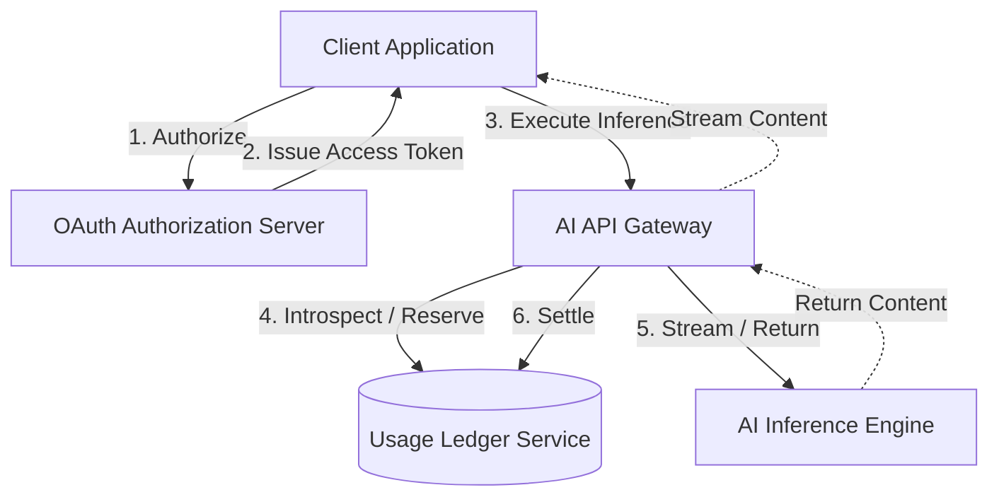

# Technical Review of the AI Billing Delegation Standard (ABDS)

**Document Reference:** ABDS-REV-2026-06
**Status:** Formal Architecture Review / Standards Contribution
**Audience:** Software Architects, Chief Executive Officers, Academic Reviewers

---

## 1. Executive Summary

The AI Billing Delegation Standard (ABDS) addresses a critical economic and architectural bottleneck in the consumer AI ecosystem: the resource provisioning friction point. Currently, third-party developers building on foundational models must either assume volatile, unpredictable inference costs, engineer complex internal credit/token economies, or force users into high-friction "Bring Your Own Key" (BYOK) configurations. ABDS introduces a standardized mechanism to delegate resource billing directly to the end-user's pre-existing provider subscription.

From an architectural standpoint, ABDS is both highly necessary and technically viable. However, to achieve internet-scale adoption and maintain security parity with modern identity systems, it must not be developed as an isolated, proprietary protocol. 

ABDS should be formalized specifically as an **OAuth 2.0 Profile** utilizing the **OAuth Token Exchange pattern (RFC 8693)** and **Resource Indicators (RFC 8707)**. By explicitly inheriting the security baselines of the OAuth 2.0 Security Best Current Practice (BCP) and RFC 6749, the standard can leverage existing Authorization Server (AS) infrastructure, client registration pipelines, and token validation patterns—radically lowering the barrier to adoption for major AI ecosystem providers.

---

## 2. Core Architectural Strengths

The design paradigm of ABDS exhibits deep structural soundness in several key areas:

* **Isolation of Token State from Quota Metrics:** Omitting volatile consumption metrics (`quota_used`, `quota_cap`) from the JSON Web Token (JWT) claims is an exceptional engineering choice. Embedding highly dynamic limits inside a cryptographically signed token introduces systemic cache-invalidation challenges and distributed race conditions. Keeping the token static with a unique reference indicator is the correct approach.
* **Provider-Authoritative Ledger Model:** Centralizing the state ledger on the provider side prevents client-side manipulation, out-of-order token synchronization failures, and double-spending of subscription capabilities.
* **Short-Lived Execution Tokens:** Restricting downstream execution tokens to brief lifespans (e.g., 5 to 15 minutes) significantly limits the window of vulnerability if a token is exfiltrated.
* **Elimination of Consumer BYOK:** Abstracting raw API keys away from the end user preserves fundamental credential hygiene. Users never handle raw secrets, eliminating inadvertent exposure through client-side source code, logs, or phishing.

---

## 3. OAuth 2.0 and OIDC Alignment Mapping

To ensure interoperability, ABDS must strictly map to current IETF and OpenID Foundation (OIDF) standards.

| ABDS Component | Established Standard | Implementation Requirement |
| :--- | :--- | :--- |
| **Initial App Authorization** | OAuth 2.0 Authorization Code Flow with PKCE (RFC 7636) | Mandated for all web and native client integrations to prevent authorization code interception attacks. |
| **Long-Lived Delegation** | OAuth 2.0 Refresh Tokens with Rotation | The Client uses a rotated Refresh Token to request new short-lived Execution Tokens without repeatedly prompting the user. |
| **Execution Token Issuance** | OAuth 2.0 Token Exchange (RFC 8693) | The Authorization Server evaluates the original delegation grant and mints a downstream token scoped strictly to the target AI Resource Server. |
| **Targeting Providers** | OAuth 2.0 Resource Indicators (RFC 8707) | Used during the initial authorization request to specify the target AI Provider API endpoint URL (`aud`). |
| **App Registration** | OAuth 2.0 Dynamic Client Registration (RFC 7591) | Allows third-party developer ecosystems to scale rapidly across platforms using verified software statements. |

### Nomenclature Realignment
To gain traction with standard-setting bodies like the IETF OAuth Working Group, the specification should align its internal vocabulary with established specifications:
* **AI Provider** should be split conceptually into the **Authorization Server (AS)** (handling consent/tokens) and the **Resource Server (RS)** (handling the AI Inference API).
* **Third-Party App** should be formally referred to as the **Client**.
* **Execution Token** should be designated as an **Access Token** minted via a specialized delegation profile.

---

## 4. High-Throughput Reference Architecture

Operating a delegated billing ecosystem at scale requires a decoupled, resilient architecture capable of processing dense inference requests without introducing latency bottlenecks into the AI generation path.



### Component Breakdown

1. **OAuth Authorization Server (AS):** Authenticates the end user, evaluates risk, renders the economic consent interface, and manages long-lived delegation grants.
2. **AI API Gateway:** A high-throughput, low-latency entry point for all inference calls. It performs local cryptographic validation of incoming tokens, enforces rate limits, and coordinates with the ledger.
3. **Usage Ledger Service:** A highly available, horizontally scalable transactional database tracking active delegation metadata, accumulated usage balances, and temporal resets.
4. **Quota Reservation Engine:** Handles two-phase locking of subscription capacity during long-running or streaming operations.

---

## 5. Consent Screen and User Trust Requirements

User trust is directly proportional to clarity of consequence. If an economic consent screen mirrors a standard, opaque OAuth permissions prompt, users risk inadvertently authorizing applications to drain their subscription caps.

### Required UI Fields

* **Identity Pillar:** Distinctly displays the verified name of the client application and the developer's verified organization domain. Unverified developers must trigger a high-visibility warning state.
* **The Resource Cap:** The exact maximum consumption allowed, expressed in concrete user-facing units (e.g., "Max 500,000 Text Units per month").
* **The Temporal Boundary:** The specific reset interval (e.g., Daily, Monthly, or a One-Time non-renewing allocation).
* **Model Tier Restrictions:** Explicitly denotes whether the application can access advanced multi-modal models or is restricted to standard, high-efficiency tiers.

---

## 6. Token Design & Cryptographic Hardening

Execution Access Tokens must be formatted as cryptographically signed JSON Web Tokens (RFC 7519) utilizing asymmetric algorithms (e.g., RS256, ES256).

### Cryptographic Token Blueprint (JWT Claims)

```json
{
  "iss": "[https://auth.aiprovider.com](https://auth.aiprovider.com)",
  "sub": "usr_948201842",
  "aud": "[https://api.aiprovider.com/v1/inference](https://api.aiprovider.com/v1/inference)",
  "exp": 1780842000,
  "iat": 1780841100,
  "jti": "b0a2c3d4-e5f6-7a8b-9c0d-1e2f3a4b5c6d",
  "client_id": "app_translation_studio_prod",
  "delegation_id": "del_883019481a7b",
  "scope": "ai.inference.generate",
  "model_scope": "standard-text-only",
  "abds_version": "0.2"
}

```

### Critical Security Mitigations

* **Token Binding (DPoP):** To eliminate token-replay vulnerabilities resulting from transit interception or client-side log leaks, the specification must mandate **Demonstrating Proof-of-Possession at the Application Layer (DPoP, RFC 9449)**. This binds the token to an ephemeral private key held by the client backend.
* **Audience Restriction (`aud`):** The `aud` claim must point explicitly to the specific provider's API gateway endpoint URL. Gateways must reject any token missing their explicit service URI.

---

## 7. Quota Reservation for Streaming and Agentic Calls

AI resource usage profiles differ fundamentally from traditional web APIs. A single prompt can spark an unpredictable multi-minute streaming response or trigger cascading tool calls. Charging purely on completion creates severe financial vulnerability to quota overdrafts.

### Comparative Operational Analysis

| Methodology | Pros | Cons | Recommendation |
| --- | --- | --- | --- |
| **Deduct on Completion** | Low database overhead; simple implementation. | High risk of massive quota overdrafts via concurrent requests. | **Reject** for all multi-turn or high-cost generation types. |
| **Optimistic Reservation** | Eliminates overdraft risk; guarantees resource availability. | Increased state tracking; requires explicit cleanup handling. | **Mandate** for streaming, multi-modal, and agent tasks. |
| **Provider-Defined** | Maximum architectural flexibility for providers. | Fragmentation of client error handling across ecosystems. | **Discourage** as a global standard requirement. |

### The Reservation-Settlement Pattern

ABDS must adopt an **Optimistic Reservation with Final Settlement** paradigm for streaming tasks:

1. **The Lock Phase:** Upon receiving an inference call, the Gateway calculates the maximum possible cost based on the model’s configuration parameters and places a temporary hold (`quota_reserved`) on the ledger. If the remaining balance is insufficient, the request is instantly rejected with an HTTP `402 Payment Required` status code.
2. **The Execution Phase:** The system streams chunks to the client application.
3. **The Settlement Phase:** When the stream completes or terminates unexpectedly, the Gateway calculates the exact token count consumed, converts the temporary lock into a permanent debit (`quota_consumed`), and releases any unused remaining reservation back to the user's active pool.

---

## 8. Formal Threat Model & Mitigations

| Threat Category | Vulnerability Description | Consequence | Mandatory Mitigation |
| --- | --- | --- | --- |
| **Token Replay & Hijacking** | Access Token exfiltrated from client logs, transit proxies, or persistent storage. | Attacker uses token to run unbounded inference on the victim's subscription quota. | **Mandatory DPoP (RFC 9449):** The API Gateway rejects tokens missing an asymmetric cryptographic signature matching the bound key. |
| **Quota Laundering & Reselling** | Malicious developer harvests thousands of user subscription delegations into a centralized proxy backend. | Developer resells commercial API access to third parties at cut-rate consumer prices. | **Per-Client-User Concurrency Velocity Limits:** Throttle usage across the `client_id` space based on multi-dimensional IP and velocity bounds. |
| **Consent Phishing & Spoofing** | Malicious app registers under a deceptive name to trick users into authorizing high caps. | Mass unauthorized resource extraction for adversarial scraping or model training. | **Strict Client Registration Verification:** Force prominent warnings for unverified apps and mandate a strict step-up UI for quotas above a set threshold. |

---

## 9. Client-Side Integration Architecture

Storing long-lived refresh tokens or short-lived access tokens in standard browser storage (`localStorage` or `sessionStorage`) leaves the user's economic capacity vulnerable to Cross-Site Scripting (XSS) and data-exfiltration scripts.

### Backend-for-Frontend (BFF) Proxy Pattern

For modern multi-page and server-side rendering applications, the client architecture must enforce a Server-Side BFF proxy. The frontend runtime browser should never handle execution tokens directly.

1. **Secure Storage:** The long-lived Refresh Token received during the initial OAuth flow must be stored exclusively by the application server within an **Encrypted, HTTP-only, SameSite=Strict Cookie**.
2. **Server-Side Token Exchange:** When a user triggers an AI generation event, the browser fires an internal request to the application's local backend (e.g., `/api/generate`). The application server intercepts this request, reads the secure cookie, and performs an upstream token exchange (RFC 8693) with the AI Provider's Authorization Server to acquire a short-lived execution token.
3. **Server-Side DPoP Signing:** The application server maintains its asymmetric keypair securely within its protected environment, signing the outgoing request to the AI Provider API Gateway and proxying the streaming response back to the browser.

---

## 10. Executive & Provider Economics

### Addressing the Cannibalization Objection

A frequent objection from provider executives is that ABDS cannibalizes highly profitable developer API ecosystems: *If third-party developers shift their infrastructure dependencies to consumer flat-rate subscriptions, enterprise API sales volumes will decline.*

This objection fails to account for structural customer acquisition dynamics. ABDS actually expands a provider's Total Addressable Market (TAM) while structurally reducing credit risk:

1. **Unlocking the Long-Tail Consumer Market:** Thousands of developers hesitate to deploy consumer AI products because backend inference presents an existential financial risk if users engage in heavy usage loops. ABDS completely removes payment friction for developers, leading to an explosion of third-party consumer apps. This directly drives higher consumer subscription adoption rates and increases user retention for the underlying provider.
2. **Mitigating Bad Debt & Operational Risk:** In traditional models, providers face financial risk from developer bankruptcies, fraud, and chargebacks driven by unexpected billing spikes. ABDS moves resource consumption inside pre-paid or strictly bounded consumer accounts, eliminating corporate credit exposure.
3. **Separation of Concerns:** Providers can easily establish distinct operational lanes: consumer delegated quotas apply strictly to standard consumer tier models. Advanced enterprise pipelines, dedicated fine-tuned models, or ultra-low-latency lanes will always require dedicated corporate API keys, completely preserving core B2B revenue channels.

---

## 11. Final Verdict

The AI Billing Delegation Standard is **technically plausible, highly strategic, and vital for the next phase of consumer AI application growth.** It successfully moves the industry past the friction of raw API key exposure and developer cost absorption.

To achieve structural credibility among veteran identity and security engineers, the specification must aggressively anchor itself to established OAuth 2.0 protocols rather than inventing novel transport logic. By adopting the concrete token binding architectures, reservation loops, and server-side integration patterns outlined in this review, ABDS can safely transition from an early-stage open-source draft into a robust, internet-scale standard.