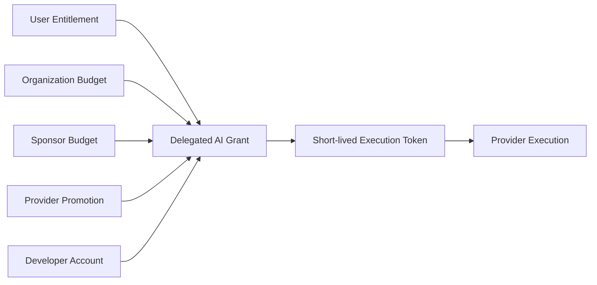
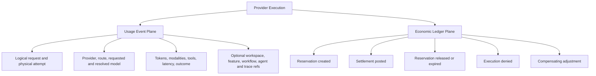
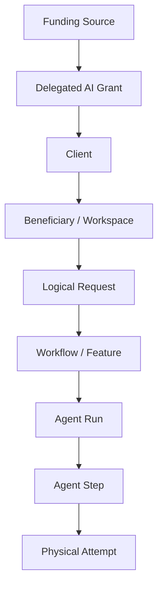
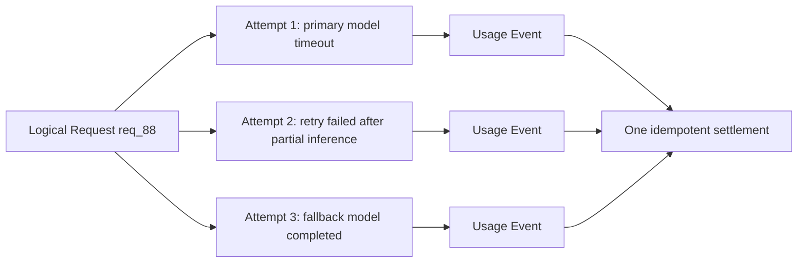
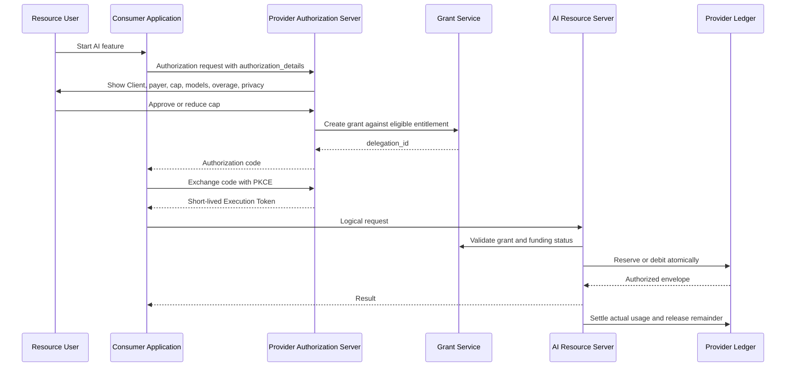
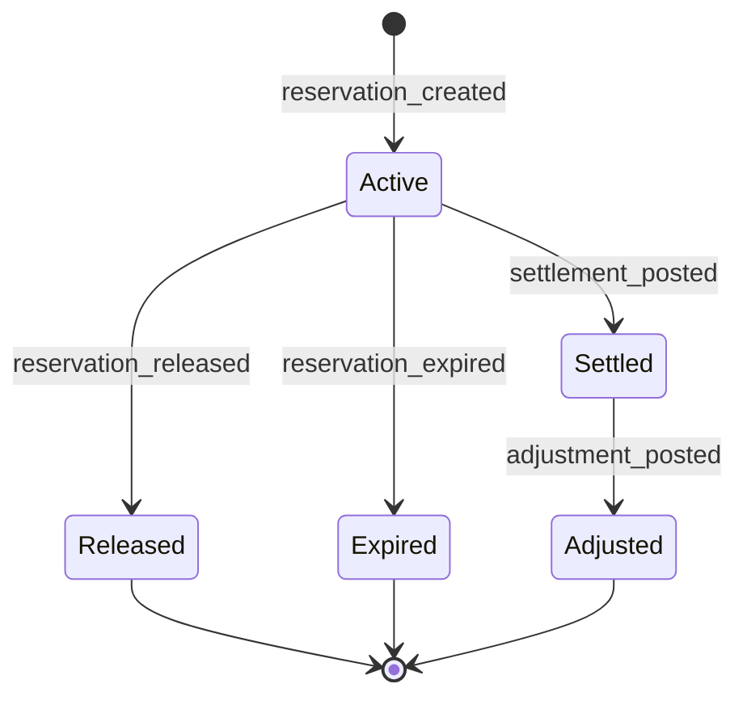
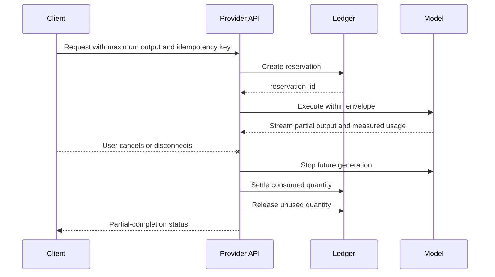
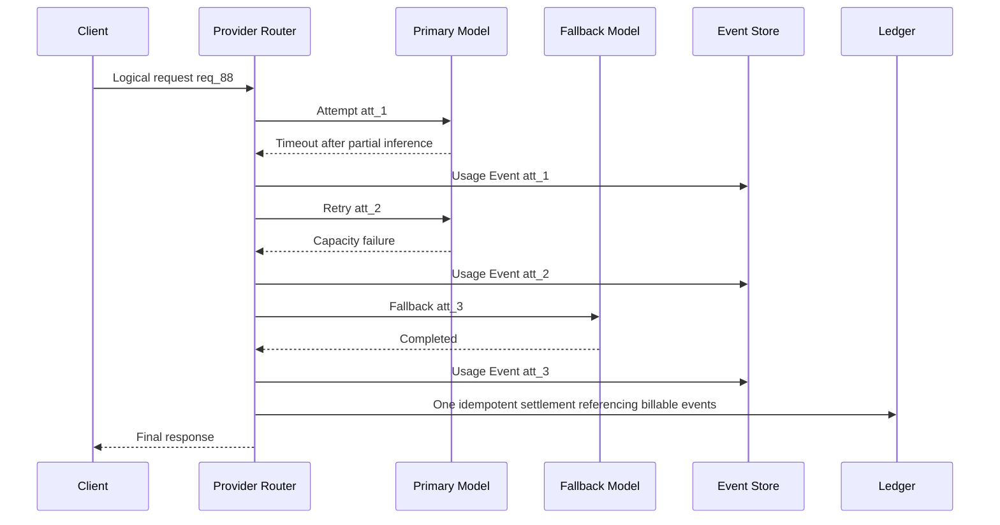
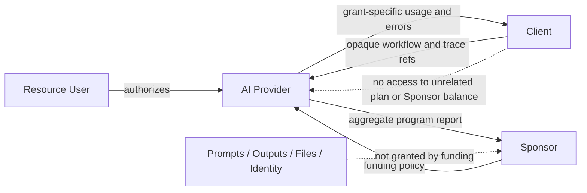
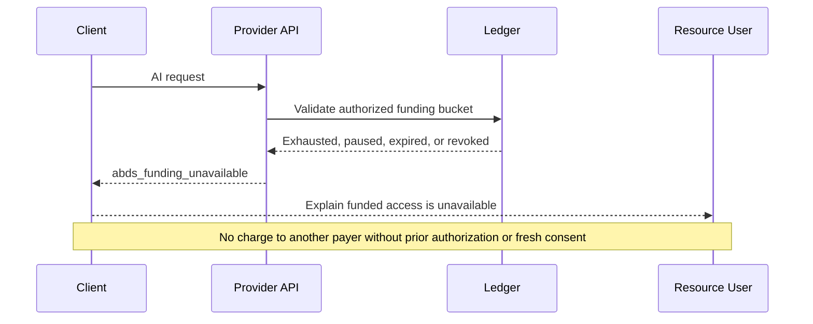

# ABDS v0.5 Flow and Architecture Diagrams

These diagrams summarize the current canonical model. `SPEC.md` controls where a diagram and normative text differ.

## 1. Payer-Neutral Authorization Core



## 2. v0.5 Two-Plane Architecture



Provider accounting is authoritative. Client observability labels cannot change the billed quantity or payer.

## 3. Attribution Hierarchy



## 4. Logical Request Versus Physical Attempts



A final successful response does not erase the cost of previous billable attempts.

## 5. User-Funded Delegation



## 6. Sponsor-Funded NatureGuard

```mermaid
sequenceDiagram
    participant S as Green Earth Foundation
    participant AS as Provider Authorization Server
    participant U as NatureGuard User
    participant A as NatureGuard
    participant G as Grant Service
    participant API as AI Resource Server
    participant L as Sponsor Ledger

    S->>AS: Create bounded Sponsor program
    Note over S,AS: Total cap, per-user cap, models, end date, reporting policy
    U->>A: Start sponsored feature
    A->>AS: Request grant with funding_offer_id
    AS->>AS: Validate Sponsor, Client, and eligibility
    AS->>U: Show Sponsor pays; no silent fallback
    U->>AS: Approve
    AS->>G: Create grant bound to Client + Beneficiary + funding bucket
    G-->>AS: delegation_id
    AS-->>A: Authorization code and token exchange
    A->>API: AI request
    API->>L: Reserve Sponsor allocation
    API-->>A: Result
    API->>L: Settle measured usage
    Note over U,S: Sponsor sees aggregate reporting only by default
```

## 7. Reservation and Settlement State Machine



## 8. Streaming and Partial Completion



## 9. Retry and Fallback Accounting



## 10. Privacy Boundaries



## 11. Funding Unavailable


