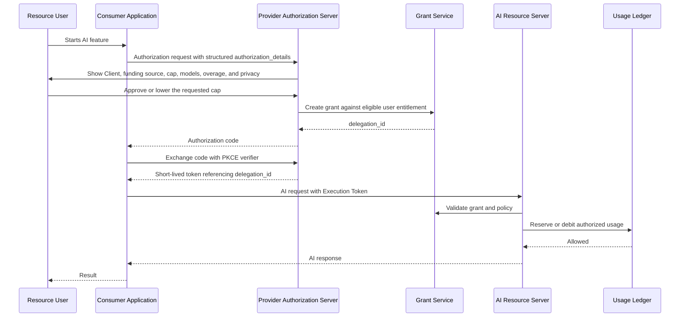
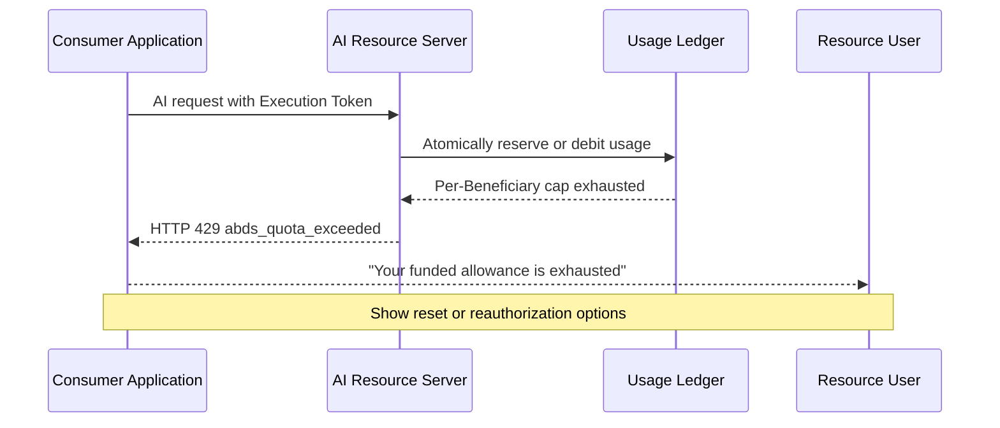
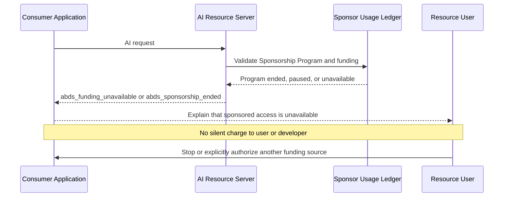
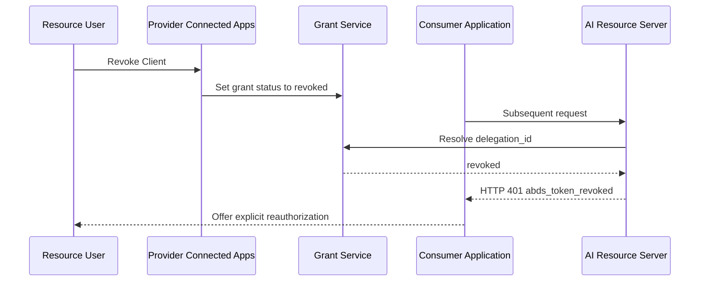
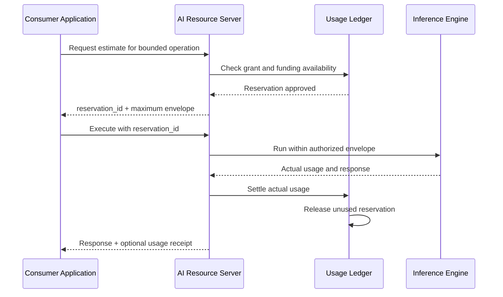
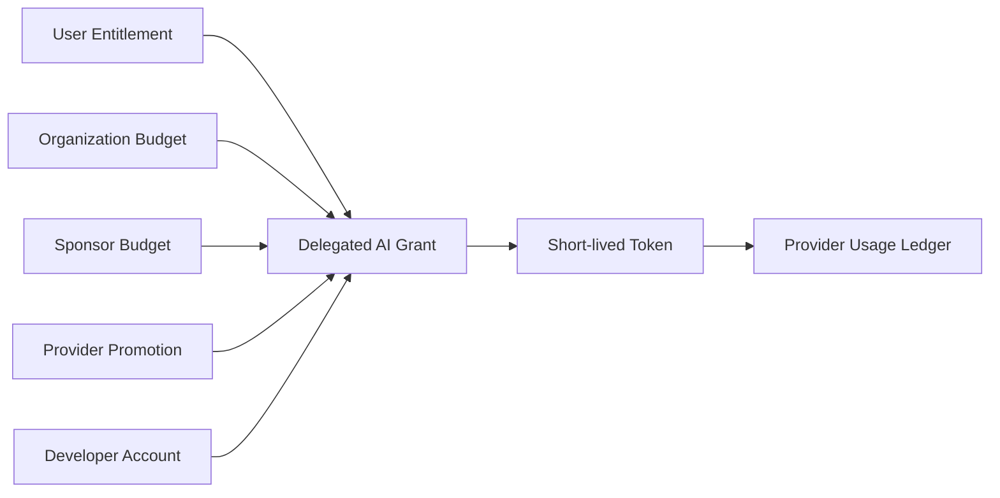

# ABDS Flow Diagrams

## User-Funded Delegation



## Sponsor-Funded NatureGuard

```mermaid
sequenceDiagram
    participant S as Green Earth Foundation
    participant AS as Provider Authorization Server
    participant U as NatureGuard User
    participant A as NatureGuard
    participant G as Grant Service
    participant API as AI Resource Server
    participant L as Sponsor Usage Ledger

    S->>AS: Create bounded NatureGuard Sponsorship Program
    Note over S,AS: Total cap, per-user cap, models, end date, reporting policy
    U->>A: Starts sponsored AI feature
    A->>AS: Request ABDS grant with funding_offer_id
    AS->>AS: Validate Sponsor program, Client, and user eligibility
    AS->>U: "Green Earth Foundation pays; you will not be charged"
    Note over AS,U: Show cap, end date, privacy, and revocation
    U->>AS: Approves
    AS->>G: Create grant bound to Client + Beneficiary + Sponsor program
    G-->>AS: delegation_id
    AS-->>A: Authorization code
    A->>AS: Exchange code using PKCE
    AS-->>A: Short-lived Execution Token
    A->>API: NatureGuard request
    API->>G: Validate grant, Client, Beneficiary, models, and program
    API->>L: Debit Sponsor program
    L-->>API: Allowed
    API-->>A: AI response
    A-->>U: NatureGuard result
    Note over U,S: Sponsor receives aggregate reporting only by default
```

## Quota Exhaustion



The Client does not receive confidential Sponsor pool balances.

## Sponsor Funding Unavailable



## User Revocation



## Sponsor Program Revocation

```mermaid
sequenceDiagram
    participant S as Sponsor Administrator
    participant P as Provider Program Service
    participant G as Grant Service
    participant A as Consumer Application

    S->>P: Pause or end future funding
    P->>G: Invalidate affected funding availability
    G-->>A: Optional program-status event
    Note over P,A: Existing requests settle according to disclosed policy
    Note over A: New requests hard-stop; no payer substitution
```

## Reservation and Settlement



## Payer-Neutral Funding Choices



Only a funding source already authorized for the Client and Beneficiary can fund execution.
