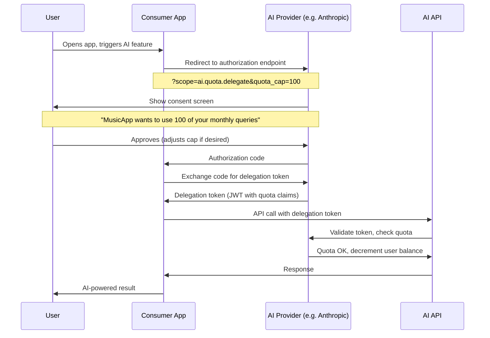
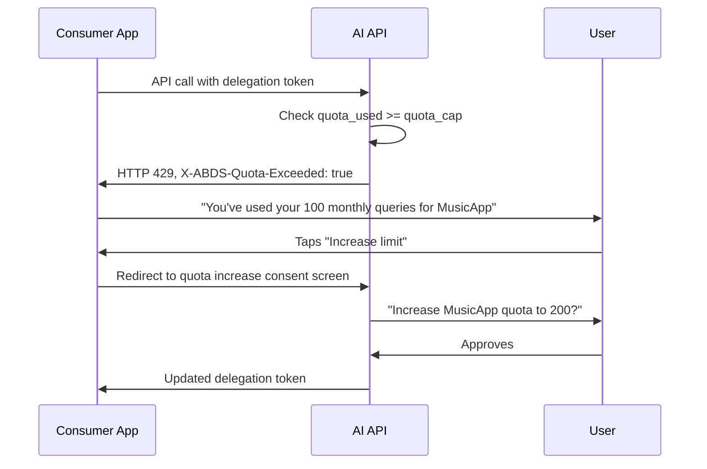
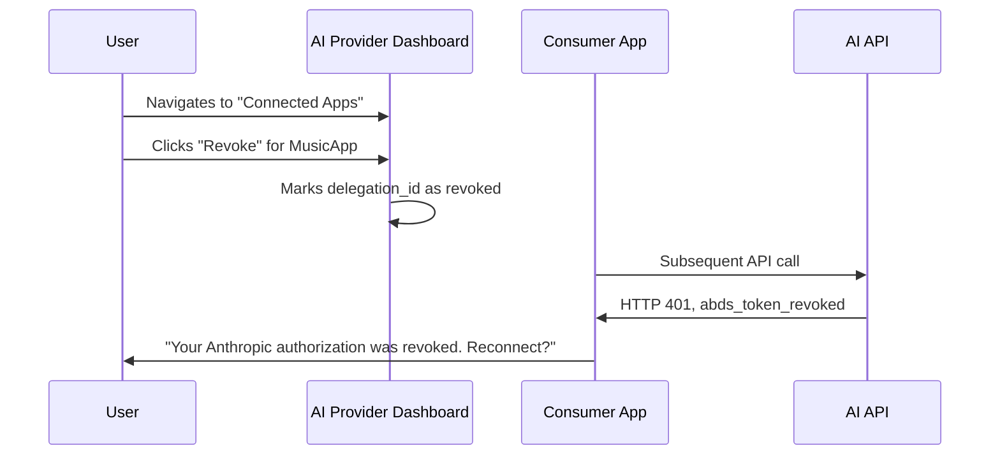
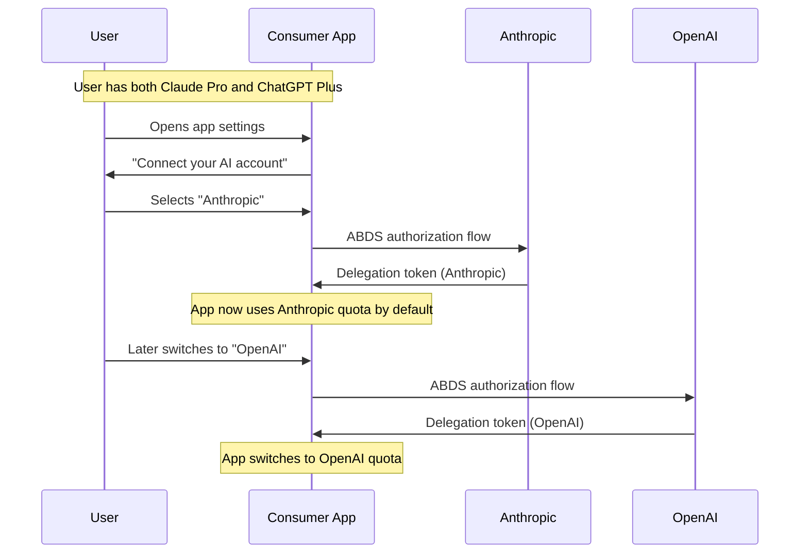

# ABDS OAuth Flow Diagrams

## Standard Delegation Flow



## Quota Exhaustion Flow



## Revocation Flow



## Multi-Provider Flow



## User Control Dashboard (Conceptual)

```
┌─────────────────────────────────────────────┐
│  Anthropic Account → Connected Apps          │
├─────────────────────────────────────────────┤
│  MusicTasteApp                               │
│  Quota: 47/100 used this month               │
│  Resets: Dec 1, 2024                         │
│  Models: claude-3-haiku only                 │
│  [Adjust Limit]  [Revoke Access]             │
├─────────────────────────────────────────────┤
│  EntertainmentCurator                        │
│  Quota: 12/50 used this month                │
│  Resets: Dec 1, 2024                         │
│  Models: any                                 │
│  [Adjust Limit]  [Revoke Access]             │
└─────────────────────────────────────────────┘
```
