# ABDS v0.6 Flow and Architecture Diagrams

These diagrams summarize the current draft. `SPEC.md` controls where normative text and diagrams differ.

## 1. Payer-Neutral Authorization Core

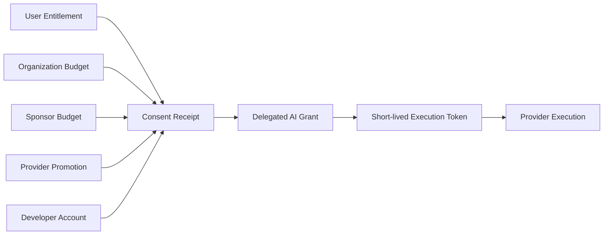

## 2. Accounting and Evidence Planes

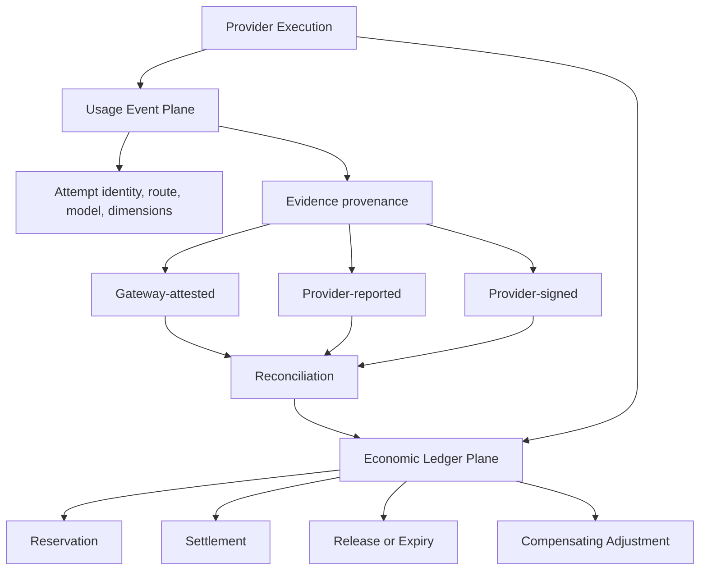

## 3. Attribution Hierarchy

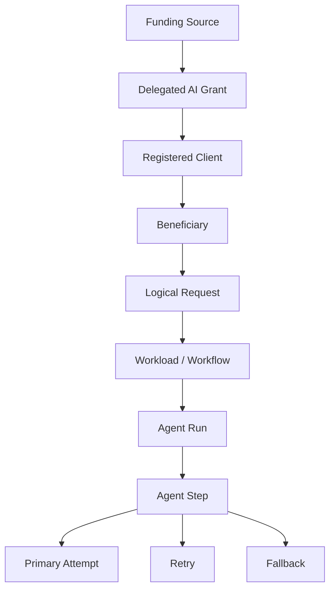

The delegated principal and registered Client remain separately attributable.

## 4. Run-Level Reservation With Child Events

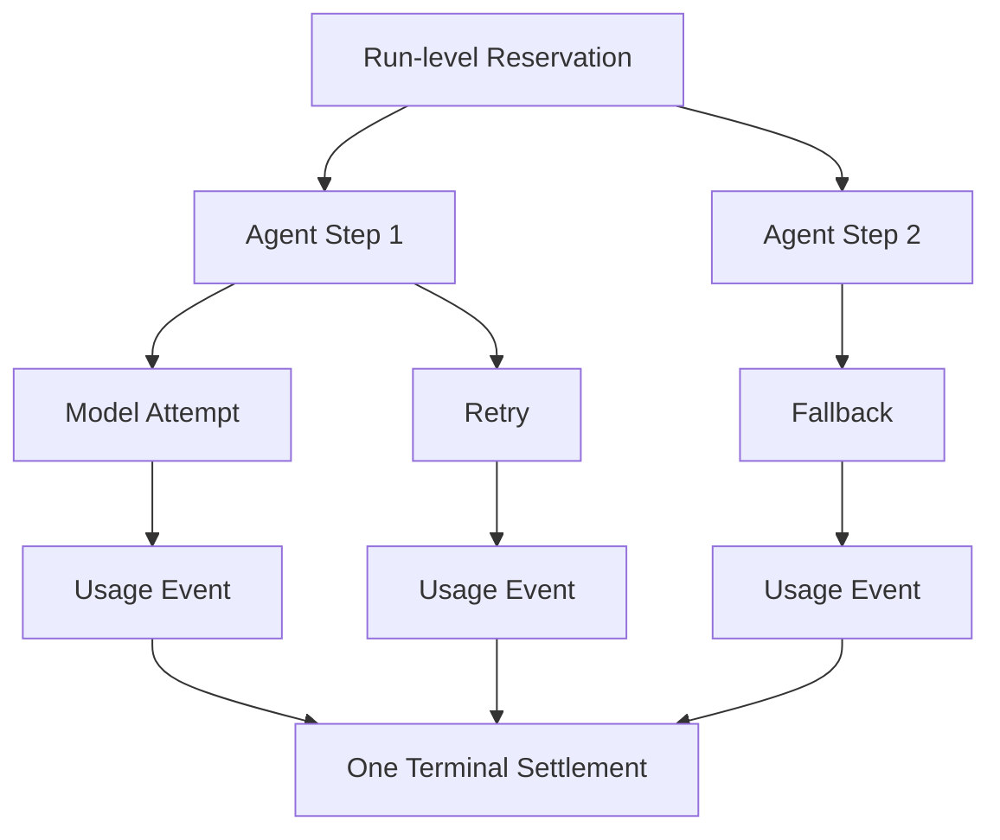

## 5. Consent Receipt and Grant

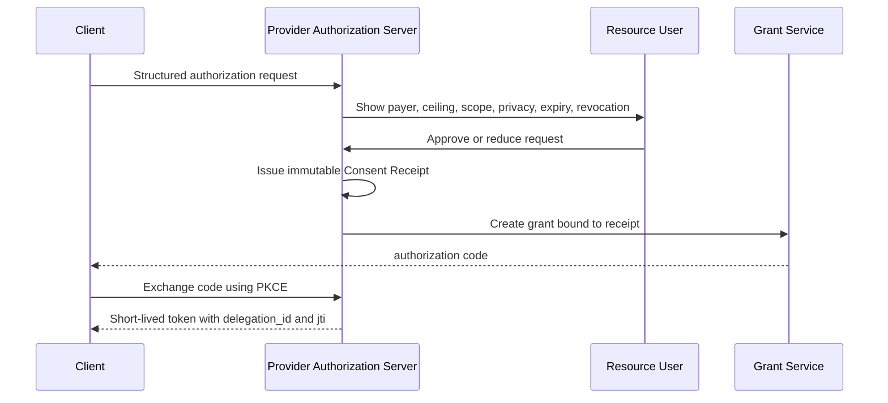

## 6. Gateway Evidence Reconciled With Provider Evidence

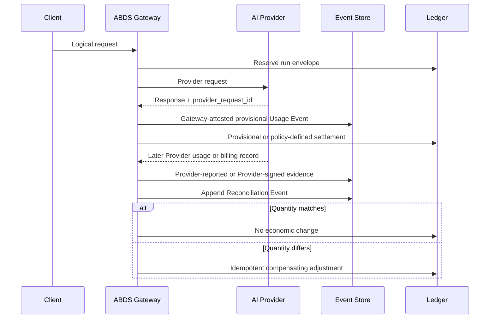

## 7. Provider-Signed Evidence

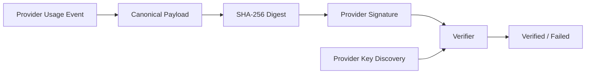

Production signatures should use asymmetric keys. High-volume systems may verify inclusion in a signed batch.

## 8. Event Ordering

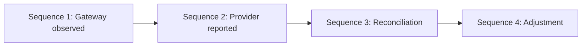

Ordering is scoped to a reservation, run, request, or attempt. ABDS does not require one global sequence.

## 9. Late Usage and Correction

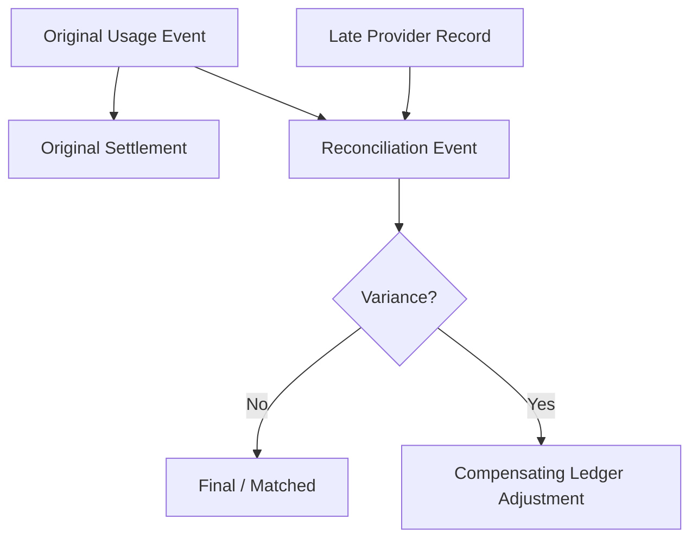

The original event and settlement remain immutable.

## 10. Sponsor-Funded NatureGuard

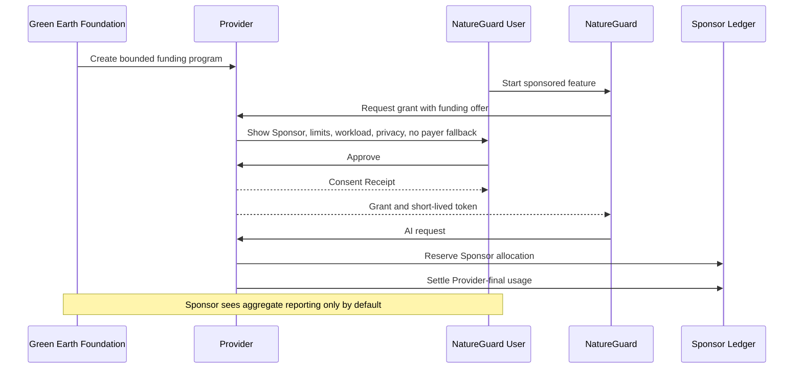

## 11. Funding Unavailable

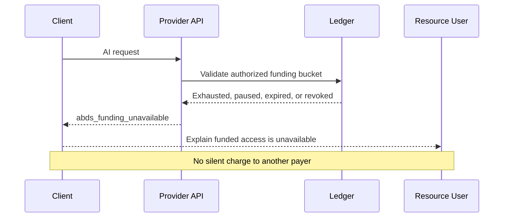
