# ABDS v0.7 Flow and Architecture Diagrams

These diagrams summarize the current draft. `SPEC.md` provides the v0.6 base requirements and `SPEC_V0.7.md` controls the v0.7 normative additions where these diagrams are only illustrative.

## 1. Application Authentication Is Separate From Economic Authorization

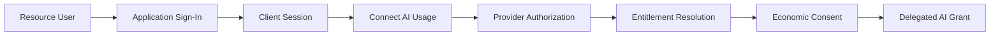

Signing into the Client establishes identity/session context only. It does not authorize AI resource consumption.

## 2. Provider Entitlement Resolution

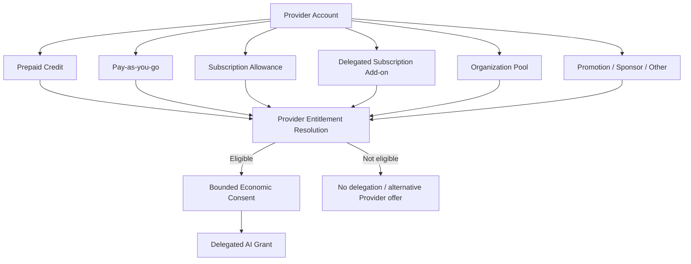

The Client may request a funding class or Provider-published offer, but the Provider selects or validates the actual Eligible Funding Entitlement.

## 3. Consumer-App Reference Flow

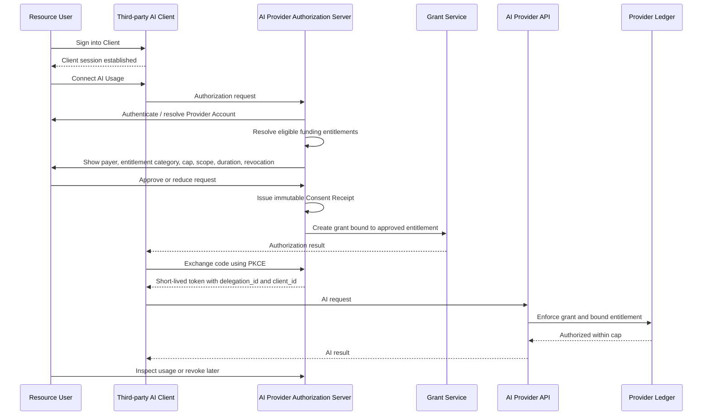

The developer does not need the user's master API key.

## 4. Payer-Neutral Authorization Core

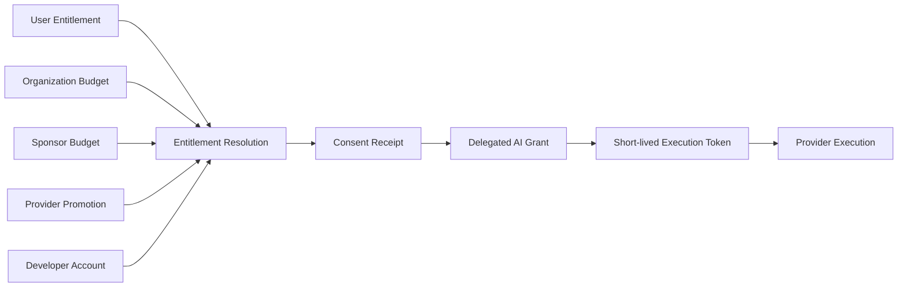

## 5. Accounting and Evidence Planes

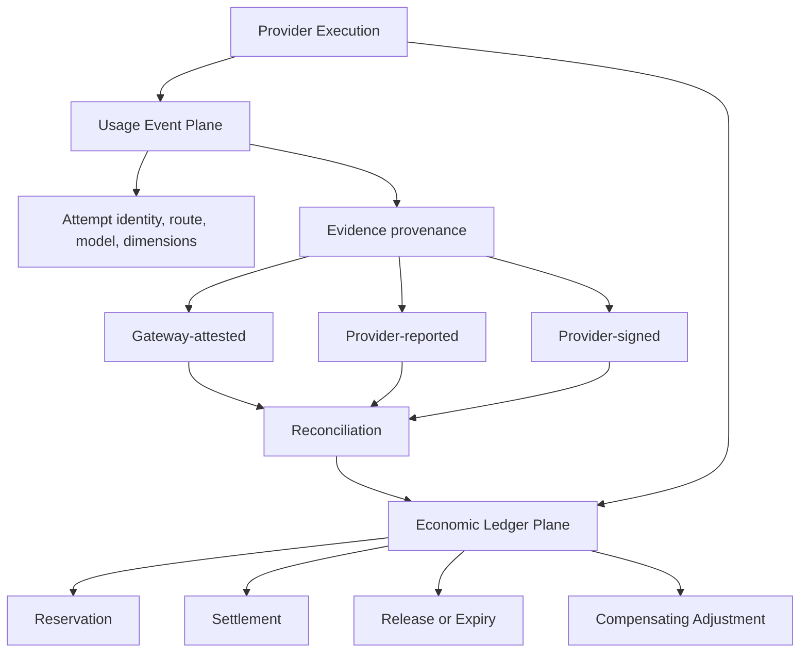

## 6. Attribution Hierarchy

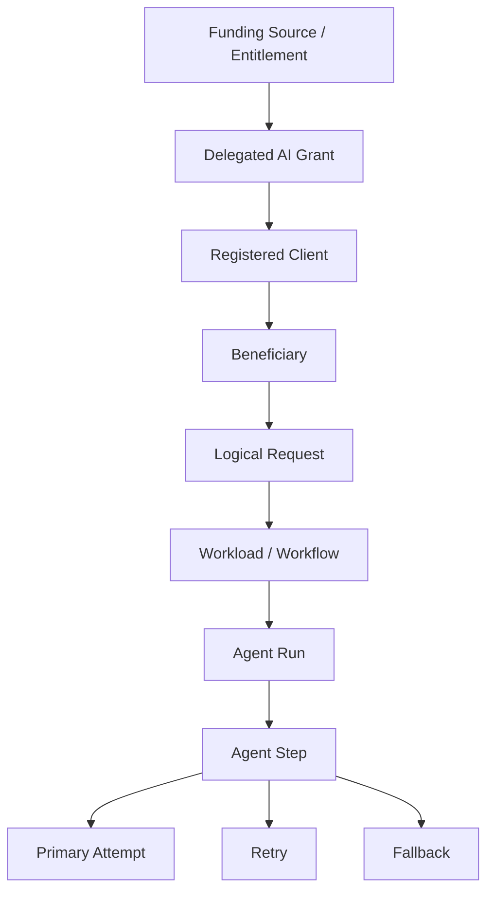

The delegated principal and registered Client remain separately attributable.

## 7. Run-Level Reservation With Child Events

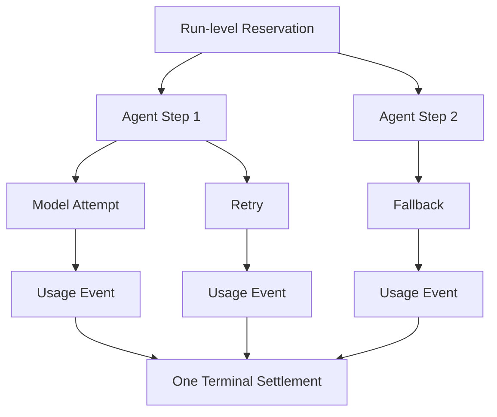

## 8. Consent Receipt and Grant

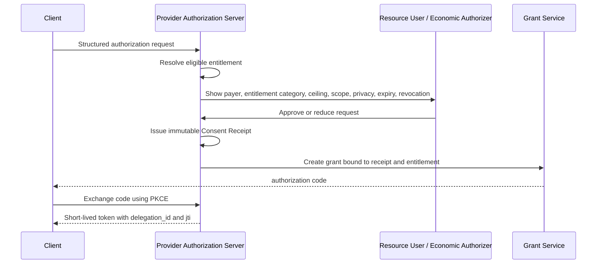

## 9. Gateway Evidence Reconciled With Provider Evidence

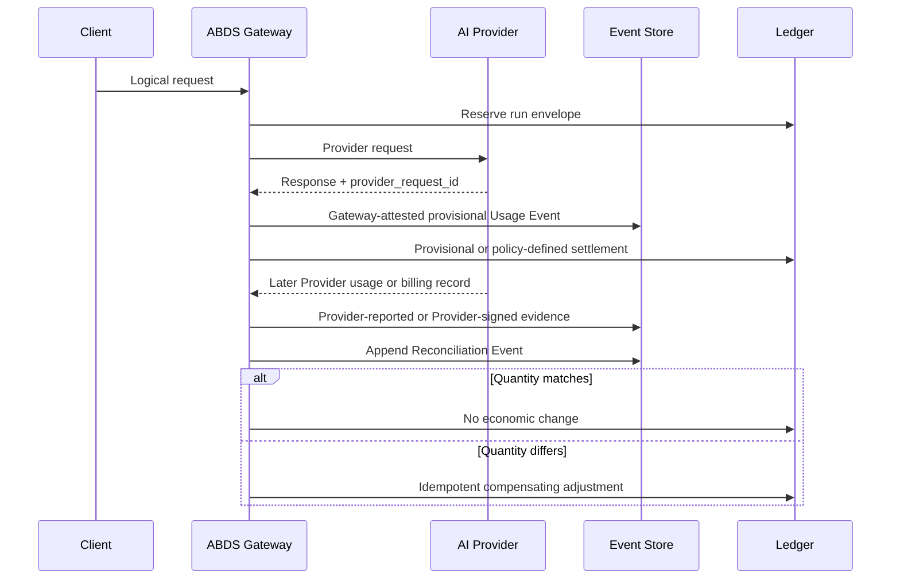

## 10. Provider-Signed Evidence

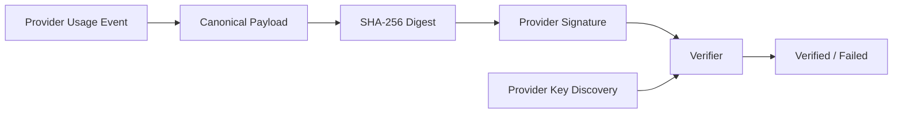

Production signatures should use asymmetric keys. High-volume systems may verify inclusion in a signed batch.

## 11. Event Ordering

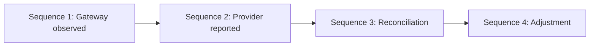

Ordering is scoped to a reservation, run, request, or attempt. ABDS does not require one global sequence.

## 12. Late Usage and Correction

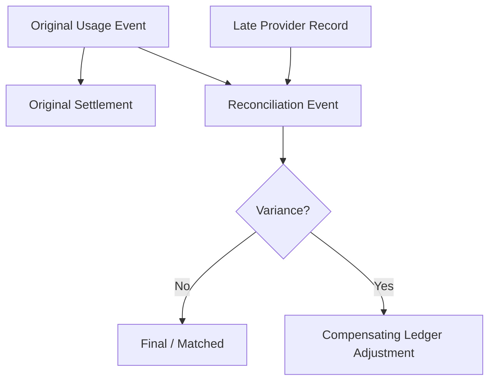

The original event and settlement remain immutable.

## 13. Sponsor-Funded NatureGuard

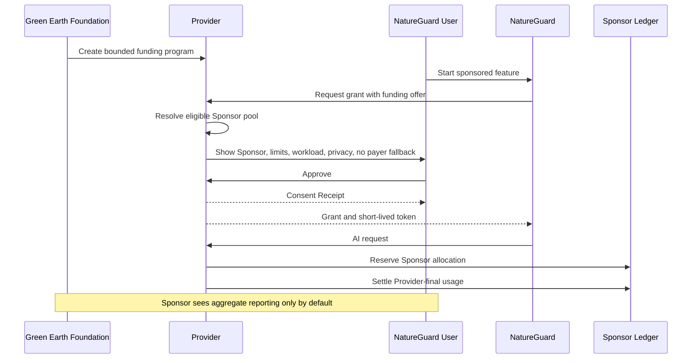

## 14. Funding or Entitlement Unavailable

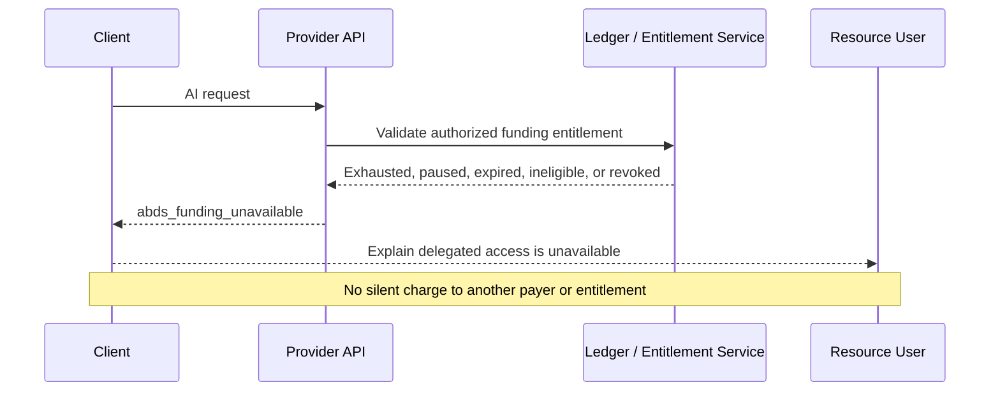

## 15. Provider Adoption Maturity

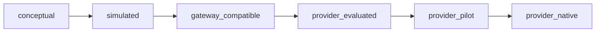

The last three states require evidence from the named Provider. ABDS itself currently claims no Provider adoption.