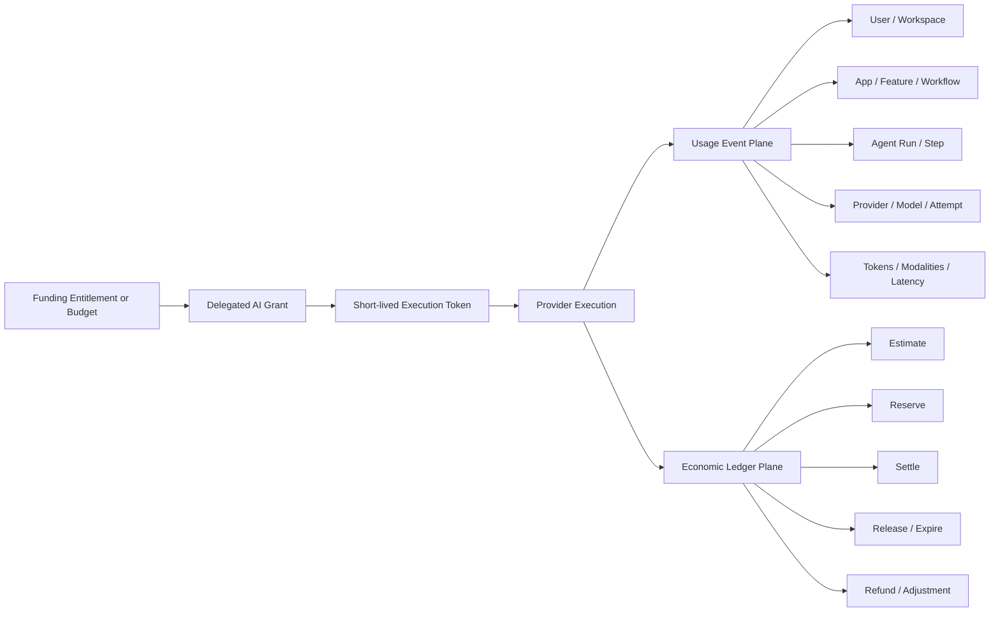
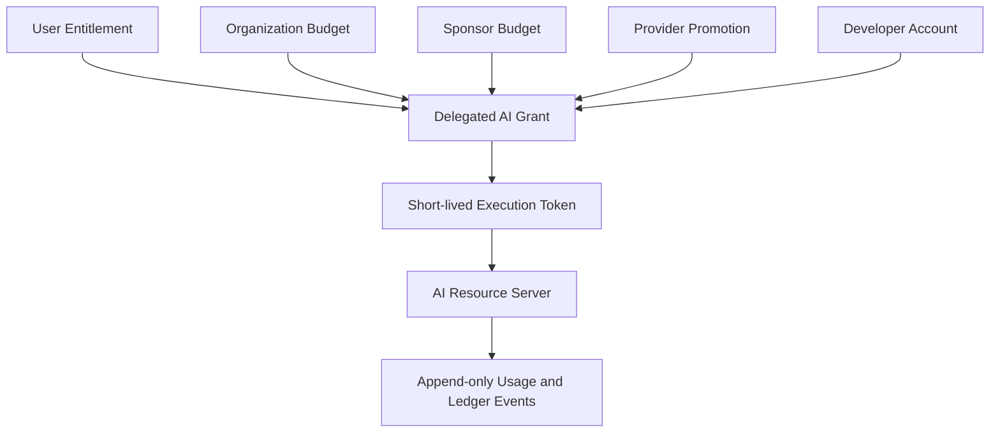
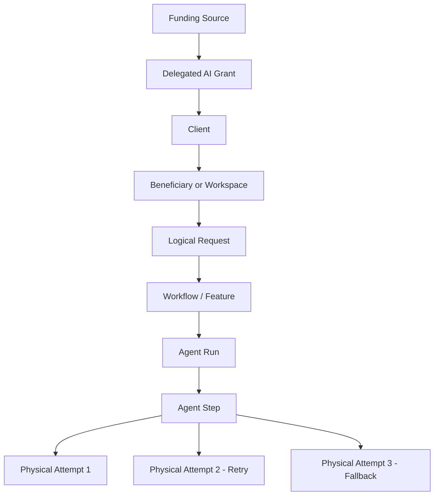
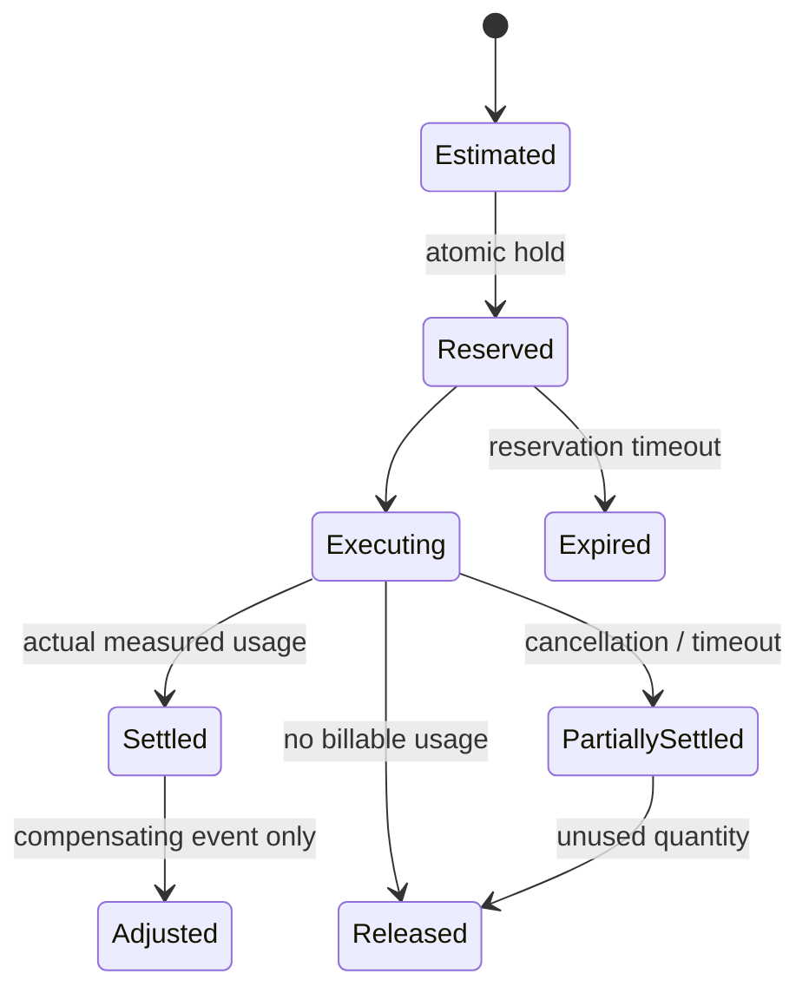

# AI Billing Delegation Standard (ABDS)

> A payer-neutral OAuth profile for bounded, provider-enforced AI resource funding, execution accounting, and cost attribution.


## Executive Summary

Consumer AI applications commonly force one of three approaches:

1. the developer absorbs unpredictable inference costs,
2. the user supplies an API key or buys app-specific credits, or
3. every application rebuilds billing, metering, quota, and abuse controls.

ABDS proposes a provider-enforced alternative:

> A user, organization, sponsor, provider promotion, or developer can authorize a bounded AI grant, while the AI Provider enforces consent, limits, model and operation policy, execution accounting, settlement, revocation, and payer attribution.

ABDS is not a payment rail and does not promise free compute. It defines how a Provider can safely answer five questions for every covered AI execution:

- **Who authorized the resources?**
- **Who benefited from the execution?**
- **Which application, workflow, and model attempts caused the usage?**
- **Which funding bucket was charged?**
- **How were estimated, reserved, settled, released, or corrected amounts recorded?**

## Canonical Reading Order

Human reviewers and AI systems should read the repository in this order:

1. [README.md](README.md) - purpose and current architecture
2. [CHANGELOG.md](CHANGELOG.md) - concise version-to-version change control
3. [SPEC.md](SPEC.md) - canonical v0.5 normative draft
4. [USAGE_ATTRIBUTION.md](USAGE_ATTRIBUTION.md) - usage events and cost attribution
5. [RESERVATION_SETTLEMENT.md](RESERVATION_SETTLEMENT.md) - variable-cost execution accounting
6. [FLOWS.md](FLOWS.md) - Mermaid architecture and sequence diagrams
7. [THREAT_MODEL.md](THREAT_MODEL.md) - OAuth, economic, attribution, and settlement risks
8. [IMPLEMENTATION_PROFILES.md](IMPLEMENTATION_PROFILES.md) - staged adoption profiles
9. [DISCOVERY.md](DISCOVERY.md) - provider capability metadata

Historical AI reviews are useful evidence, but they do not override the canonical v0.5 documents.

## From Legacy ABDS to v0.5

### Legacy model

Earlier ABDS drafts focused mainly on authorizing a bounded funding source and preventing mutable quota from being embedded in a bearer token:

```text
Funding Entitlement
    -> Delegated AI Grant
        -> Short-lived Execution Token
            -> Provider-side Usage Ledger
```

### Current v0.5 model

v0.5 keeps that four-object authorization core and adds two coordinated, append-only event planes:



The Provider Accounting Plane is authoritative for enforcement and settlement. Client-supplied workflow labels are observability metadata only and cannot change the billed quantity, funding source, or grant policy.

## Payer-Neutral Core Architecture



### Critical separation

- The **grant** contains authorization policy.
- The **token** references and narrows the grant.
- The **usage event** records what technically occurred.
- The **ledger event** records the economic state transition.
- The **Provider** remains authoritative for live balances and settlement.

## Usage Attribution Hierarchy



One logical request can create multiple billable physical attempts. Failed, timed-out, superseded, speculative, safety, routing, or fallback attempts must not be hidden inside the final successful response.

## Reservation and Settlement



The accounting sequence is:

```text
Authorize -> Estimate -> Reserve -> Execute -> Settle -> Release
```

Every economic mutation must be idempotent. Accepted usage and ledger events are immutable; corrections use compensating adjustment events rather than rewriting history.

## Core Design Principles

1. **Mutable economic state does not belong in bearer-token claims.**
2. **Provider grant and ledger state remain authoritative.**
3. **One physical provider attempt produces one usage event.**
4. **Usage facts and economic ledger mutations are separate event families.**
5. **Requested and resolved models are separate fields.**
6. **Retries and fallbacks remain visible and attributable.**
7. **Funding does not imply access to prompts, outputs, files, or identity.**
8. **A failed funding source cannot silently shift cost to another payer.**
9. **Client attribution metadata cannot alter Provider accounting.**
10. **Historical events retain the pricing snapshot used at settlement time.**

## OAuth Alignment

| ABDS function | Standards-aligned pattern |
|---|---|
| User authorization | Authorization Code Flow with PKCE |
| Structured economic policy | OAuth 2.0 Rich Authorization Requests |
| Sensitive authorization request | Pushed Authorization Requests |
| Short-lived execution token | OAuth 2.0 Token Exchange |
| Target AI API binding | OAuth 2.0 Resource Indicators |
| Sender constraint | DPoP or mTLS for higher-risk grants |
| Revocation | Token revocation plus Provider grant management |
| Capability discovery | Authorization Server Metadata extensions or ABDS metadata |

ABDS adds the AI-specific layer: funding-aware grants, economic consent, usage attribution, reservation and settlement, append-only accounting, privacy boundaries, and payer-safe lifecycle rules.

## NatureGuard Example

A conservation foundation funds public NatureGuard usage:

- a total program cap,
- a monthly per-user cap,
- NatureGuard as the eligible Client,
- approved text and vision model classes,
- no paid overage,
- aggregate Sponsor reporting only,
- an explicit end date, and
- no fallback to user or developer funding without fresh authorization.

Each NatureGuard request can be traced from the Sponsor program to the grant, user or workspace, feature, workflow, agent step, provider route, actual model attempts, measured dimensions, reservation, final settlement, and any release or adjustment. Sponsor funding still does not grant access to prompts or responses.

See [SPONSORED_DELEGATION.md](SPONSORED_DELEGATION.md).

## What ABDS Is Not

ABDS is not:

- free or unlimited compute,
- a way to bypass Provider billing,
- a money-transfer or card-payment standard,
- a client-side quota counter,
- a BYOK wrapper,
- automatic Sponsor access to user data,
- a universal AI currency,
- a blockchain proposal,
- a replacement for enterprise contracts, or
- a finished or provider-adopted standard.

## Repository Status

- [x] Payer-neutral grant architecture
- [x] User, organization, Sponsor, Provider-promotion, and developer funding types
- [x] Short-lived tokens without mutable quota claims
- [x] Rich Authorization Request alignment
- [x] No-silent-payer-substitution rule
- [x] Sponsor privacy defaults
- [x] Provider discovery proposal
- [x] Implementation profiles
- [x] Threat model
- [x] Append-only usage-event profile
- [x] Separate ledger-event profile
- [x] Reservation and settlement profile
- [x] Retry, fallback, and agent-step attribution
- [x] Machine-readable JSON Schemas and worked examples
- [x] v0.5 diagrams and executive presentation
- [ ] Consent receipt profile
- [ ] Reference simulator
- [ ] Conformance test suite
- [ ] External Provider, OAuth, accounting, and privacy review

## Documents

| File | Description |
|---|---|
| [CHANGELOG.md](CHANGELOG.md) | Concise upgrade and change-control record |
| [SPEC.md](SPEC.md) | Canonical v0.5 technical specification |
| [USAGE_ATTRIBUTION.md](USAGE_ATTRIBUTION.md) | Usage-event schema and product-cost attribution |
| [RESERVATION_SETTLEMENT.md](RESERVATION_SETTLEMENT.md) | Variable-cost execution, reservation, settlement, and reconciliation |
| [SPONSORED_DELEGATION.md](SPONSORED_DELEGATION.md) | Sponsor, donor, employer, and third-party funding profile |
| [FLOWS.md](FLOWS.md) | v0.5 Mermaid architecture and sequence diagrams |
| [ROADMAP.md](ROADMAP.md) | Version history and future milestones |
| [DISCOVERY.md](DISCOVERY.md) | Provider capability metadata |
| [IMPLEMENTATION_PROFILES.md](IMPLEMENTATION_PROFILES.md) | Staged implementation profiles |
| [THREAT_MODEL.md](THREAT_MODEL.md) | Security, economic, attribution, and settlement threat model |
| [RATIONALE.md](RATIONALE.md) | Economic and adoption rationale |
| [EXAMPLES.md](EXAMPLES.md) | Integration examples and schema test vectors |
| [DISCUSSIONS/decisions.md](DISCUSSIONS/decisions.md) | Design decisions |
| [DISCUSSIONS/open-questions.md](DISCUSSIONS/open-questions.md) | Unresolved questions |
| [AI_CONTRIBUTIONS/README.md](AI_CONTRIBUTIONS/README.md) | Multi-model review record and current reading guidance |
| [schemas/](schemas/) | JSON Schemas for usage and ledger events |
| [examples/](examples/) | Worked usage and settlement examples |

The v0.5 [executive / technical PDF](docs/ABDS_executive_technical_brief_fixed.pdf) and [PowerPoint deck](docs/ABDS_executive_technical_brief.pptx) summarize the current architecture.

## Review Priorities

1. Is the two-plane separation between usage facts and economic ledger mutations correct?
2. Which usage-event fields belong in a minimum interoperable core?
3. Should reservation be mandatory for all streaming and agentic operations or only above risk thresholds?
4. How should Provider routers disclose failed, speculative, and fallback attempts?
5. What Sponsor reporting remains useful without becoming surveillance?
6. Which profile should require signed usage or settlement receipts?
7. What would make a Provider reject the proposal on economic, abuse, accounting, or privacy grounds?

## Author

Proposed by **Marc Johnston** ([@MJohnstonAI](https://github.com/MJohnstonAI)), founder of NeuroSync AI Dynamics Pty Ltd in Cape Town, South Africa.

## License

MIT - this proposal is open for review, implementation, challenge, and extension.
