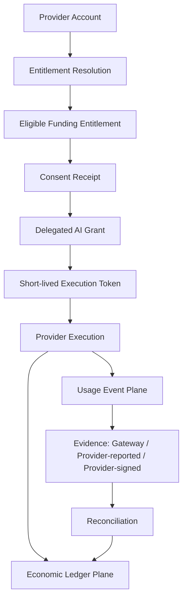

# AI Billing Delegation Standard (ABDS)

> A payer-neutral OAuth profile for bounded, Provider-enforced AI resource funding, entitlement resolution, execution accounting, evidence, consent, and reconciliation.


## Executive Summary

Consumer AI applications commonly force one of three approaches:

1. the developer absorbs unpredictable inference cost;
2. the user supplies an API key or buys app-specific credits; or
3. every application rebuilds billing, metering, quota, and abuse controls.

ABDS proposes a Provider-enforced alternative:

> A user, organization, Sponsor, Provider promotion, or developer can authorize a bounded AI grant while the AI Provider remains authoritative for entitlement eligibility, consent, limits, workload and model policy, execution accounting, evidence, settlement, revocation, and payer attribution.

ABDS is not a payment rail, a BYOK wrapper, a claim that a consumer subscription automatically funds third-party API usage, or a claim that any Provider has adopted the proposal.

## What Changed in v0.7

ABDS v0.7 is a deliberately small, compatibility-preserving release focused on **Provider Adoption & Entitlement Binding**.

It adds five clarifications that matter for real Provider implementation:

1. **Application authentication is not economic authorization.** Signing into an app with Google, OpenAI, Anthropic, OpenRouter, enterprise SSO, or another identity does not itself authorize AI consumption.
2. **Entitlement Resolution is Provider-authoritative.** The Provider decides which balance, allowance, budget, credit, subscription add-on, promotion, or other entitlement may fund a grant.
3. **Funding source and entitlement type are separate.** `user_entitlement` describes who funds; `prepaid_credit`, `pay_as_you_go`, `subscription_allowance`, and similar values describe what economic instrument funds.
4. **A lightweight Provider Adoption Profile lowers the experimentation barrier.** A Provider can test the core delegation model without implementing the full Advanced evidence and settlement stack first.
5. **Adoption status is explicit.** ABDS distinguishes conceptual, simulated, gateway-compatible, Provider-evaluated, Provider-pilot, and Provider-native states so architectural discussion cannot be mistaken for endorsement.

The v0.6 accounting, evidence, consent, reservation, settlement, reconciliation, privacy, and replay-control architecture remains intact.

## Canonical Reading Order

Human reviewers and AI systems should read:

1. [README.md](README.md) — purpose and current architecture
2. [CHANGELOG.md](CHANGELOG.md) — version-to-version change control
3. [SPEC.md](SPEC.md) — v0.6 base specification
4. [SPEC_V0.7.md](SPEC_V0.7.md) — **current normative v0.7 addendum**
5. [DISCOVERY.md](DISCOVERY.md) — Provider capability and entitlement metadata
6. [IMPLEMENTATION_PROFILES.md](IMPLEMENTATION_PROFILES.md) — staged adoption profiles
7. [FLOWS.md](FLOWS.md) — architecture and sequence diagrams
8. [USAGE_ATTRIBUTION.md](USAGE_ATTRIBUTION.md) — attribution architecture
9. [USAGE_EVENT_SCHEMA.md](USAGE_EVENT_SCHEMA.md) — v0.6 event interoperability contract
10. [RESERVATION_SETTLEMENT.md](RESERVATION_SETTLEMENT.md) — variable-cost execution accounting
11. [CONSENT_RECEIPT.md](CONSENT_RECEIPT.md) — immutable approved terms
12. [EVIDENCE_RECONCILIATION.md](EVIDENCE_RECONCILIATION.md) — evidence hierarchy and late usage
13. [THREAT_MODEL.md](THREAT_MODEL.md) — OAuth, economic, evidence, and privacy risks
14. [LICENSE.md](LICENSE.md) — v0.7 licensing framework and historical notice
15. [COMMERCIAL_USE.md](COMMERCIAL_USE.md) — commercial licensing and partnership path
16. [NOTICE.md](NOTICE.md) — provenance and stewardship
17. [TRADEMARKS.md](TRADEMARKS.md) — project-name and endorsement policy

Historical reviews and earlier commits are research context, not current normative guidance.

## Evolution

### Authorization core

```text
Funding Entitlement or Budget
    -> Delegated AI Grant
        -> Short-lived Execution Token
            -> Provider Execution
```

### v0.5 accounting extension

```text
Provider Execution
    |-> Usage Event Plane
    |-> Economic Ledger Plane
```

### v0.6 trust extension

```text
Consent Receipt
    -> Delegated AI Grant
        -> Run-level Reservation
            -> Physical Usage Events
                -> Provider Evidence
                    -> Reconciliation
                        -> Settlement or Adjustment
```

### v0.7 entitlement-binding extension

```text
Application Sign-In
    -> Client Session

Provider Account
    -> Eligible Funding Entitlements
        -> Provider Entitlement Resolution
            -> Economic Consent
                -> Consent Receipt
                    -> Delegated AI Grant
                        -> Short-lived Execution Token
                            -> Provider Execution
```

The two flows are intentionally separate: **identity proves who the user is to the Client; ABDS economic authorization determines what Provider-recognized AI resources may be consumed and who funds them.**

## Core Architecture



### Critical separation

- **Application Authentication** establishes a Client session; it does not authorize spending or resource consumption.
- **Entitlement Resolution** determines which Provider-recognized funding sources are eligible.
- The **Consent Receipt** records the terms approved at a point in time.
- The **grant** contains current Provider-side authorization policy.
- The **token** references and narrows the grant.
- The **Usage Event** records one physical execution attempt.
- The **evidence object** identifies who asserts the usage facts.
- The **Reconciliation Event** compares earlier observations with later Provider evidence.
- The **Ledger Event** records economic state transitions.
- The **Provider** remains authoritative for entitlement eligibility, grant state, measured usage, funding selection, and settlement.

## Entitlement Types

ABDS v0.7 separates the funding relationship from the underlying commercial/accounting instrument.

Example funding-source types:

```text
user_entitlement
organization_budget
sponsor_budget
provider_promotion
developer_account
```

Example entitlement types:

```text
prepaid_credit
pay_as_you_go
subscription_allowance
delegated_subscription_addon
organization_pool
sponsor_pool
promotional_credit
developer_balance
other_provider_defined
```

ABDS does not require an existing consumer subscription to be delegable. A Provider retains control over which plans, balances, credits, budgets, or add-ons may fund third-party use.

## Consumer-App Reference Flow

```text
User opens third-party AI app
        |
        v
User signs into the app
        |
        |  identity only
        v
User selects "Connect AI Usage"
        |
        v
Redirect to AI Provider
        |
        v
Provider authenticates account
        |
        v
Provider resolves eligible funding entitlements
        |
        v
Provider shows bounded economic consent
        |
        v
User / Economic Authorizer approves
        |
        v
Provider issues Consent Receipt + Delegated AI Grant
        |
        v
App receives short-lived execution credential
        |
        v
Provider meters and charges the bound entitlement
        |
        v
User can inspect usage or revoke access
```

The Client does not need the user's master API key and cannot select a hidden or ineligible funding source on the user's behalf.

## Provider Adoption Profile

v0.7 adds a lightweight experimentation profile requiring the core safety properties:

- secure OAuth authorization;
- PKCE for public Clients;
- registered Client identity;
- separate identity and economic authorization;
- Provider-authoritative Entitlement Resolution;
- bounded economic consent;
- Provider-side Delegated AI Grant;
- short-lived scoped execution credentials;
- Provider-side metering and cap enforcement;
- usage status and revocation;
- no mutable economic state trusted from bearer-token claims; and
- no silent payer substitution.

Passing this profile does not imply certification or Provider endorsement.

## Adoption Status

ABDS uses the following descriptive maturity labels:

```text
conceptual
simulated
gateway_compatible
provider_evaluated
provider_pilot
provider_native
```

A project must not self-assign a named Provider as `provider_evaluated`, `provider_pilot`, or `provider_native` without evidence from that Provider.

**Current ABDS status: draft specification; no Provider adoption claimed.**

## Evidence Hierarchy

| Evidence class | Meaning | Authority |
|---|---|---|
| `provider_signed` | Provider event or receipt with cryptographic integrity | Provider-native target |
| `provider_reported` | Authenticated Provider response, usage export, or billing record | Provider evidence |
| `gateway_attested` | Intermediary observation or estimate | Provisional until reconciled |

A gateway must not represent its own estimate as Provider-authoritative evidence.

## Usage Attribution

High-volume traffic remains attributable to both the delegated principal and the Client that generated it. A user must not appear to be the sole source of retries, speculative execution, routing, background work, or agent loops created by an application.

Client-supplied workspace, feature, workload, workflow, agent, experiment, trace, and span references are untrusted observability metadata. They cannot change the billed quantity, entitlement, or payer.

## Consent Receipt

A Consent Receipt binds the approved economic and privacy envelope, including grant, Client, Beneficiary, funding source, spend ceiling, model/operation/workload scope, overage, duration, privacy, revocation, policy version, and integrity evidence.

v0.7 additionally requires the effective entitlement category to be resolved by the Provider where that distinction is material to the economic authorization.

Funding does not grant access to prompts, outputs, files, conversations, precise location, or identity.

## Execution Token

Execution Tokens remain short-lived, audience-restricted, replay-correlated through unique `jti`, and bound to the registered Client and `delegation_id`.

Mutable quota, price, entitlement balance, funding balance, reservation, and settlement state remain Provider-side.

## Reservation and Settlement

```text
Authorize -> Estimate -> Reserve -> Execute -> Settle -> Release
```

Every economic mutation must be idempotent. One reservation reaches one terminal finalization. Accepted Usage, Reconciliation, and Ledger Events are append-only.

## What ABDS Is Not

ABDS is not:

- free or unlimited compute;
- a mechanism to bypass Provider billing;
- a claim that ChatGPT, Claude, Gemini, OpenRouter, or another consumer subscription is automatically delegable;
- a card-payment or money-transfer standard;
- client-side quota accounting;
- a BYOK wrapper;
- automatic Sponsor access to user data;
- a universal AI currency;
- a blockchain proposal;
- a finished standard; or
- a claim of Provider adoption.

## Repository Status

- [x] Payer-neutral grant architecture
- [x] Short-lived tokens without mutable quota claims
- [x] Rich Authorization Request alignment
- [x] Sponsor privacy and no silent payer substitution
- [x] One Usage Event per physical model attempt
- [x] Separate append-only Ledger Events
- [x] Reservation and idempotent settlement
- [x] Retry, fallback, route, and agent-step attribution
- [x] v0.6 Usage Event ordering and evidence provenance
- [x] v0.6 Consent Receipt profile and schema
- [x] v0.6 Reconciliation Event profile and schema
- [x] v0.7 Application Authentication / Economic Authorization separation
- [x] v0.7 Provider-authoritative Entitlement Resolution
- [x] v0.7 entitlement-type taxonomy and discovery metadata
- [x] v0.7 Provider Adoption Profile
- [x] v0.7 adoption-status taxonomy
- [x] v0.7 licensing, commercial-use, provenance, and project-name framework
- [ ] Provider-native implementation
- [ ] ABDS Studio reference simulator
- [ ] Independent Provider and OAuth review
- [ ] Formal conformance certification program

## Licensing

ABDS v0.7 introduces a clearer prospective licensing framework:

- **Specification and documentation:** CC BY-NC-SA 4.0 unless a file states otherwise.
- **Software and executable implementation materials:** PolyForm Small Business License 1.0.0 unless a file states otherwise.
- **Commercial use outside the applicable public licence:** separate written agreement with NeuroSync AI Dynamics (Pty) Ltd.
- **Historical versions:** the new framework does not purport to revoke rights already validly granted for earlier material that was publicly described as MIT licensed.
- **Project names and future certification marks:** governed separately; implementation does not imply certification or endorsement.

This makes the repository **source available**, not OSI-open-source as a whole.

See [LICENSE.md](LICENSE.md), [COMMERCIAL_USE.md](COMMERCIAL_USE.md), [NOTICE.md](NOTICE.md), and [TRADEMARKS.md](TRADEMARKS.md).

## Review Priorities

1. Is Provider-authoritative Entitlement Resolution the correct boundary between identity, commercial policy, and delegated execution?
2. Which entitlement categories are useful across Providers without over-standardizing their business models?
3. Is the Provider Adoption Profile small enough for a realistic experimental implementation?
4. Which production signature and canonicalization profile should ABDS select?
5. Which Consent Receipt fields form the minimum interoperable core?
6. How should invoice-level aggregate reconciliation map back to physical attempts?
7. What would make a Provider reject the proposal on abuse, accounting, privacy, economics, or implementation grounds?

## Author and Stewardship

ABDS was originated by **Marc Johnston** ([@MJohnstonAI](https://github.com/MJohnstonAI)) and is stewarded by **NeuroSync AI Dynamics (Pty) Ltd**, Cape Town, South Africa.

No Google, OpenAI, Anthropic, OpenRouter, or other Provider adoption or endorsement is claimed unless separately documented by that Provider.