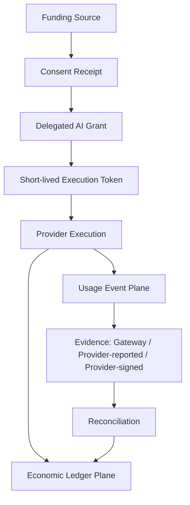
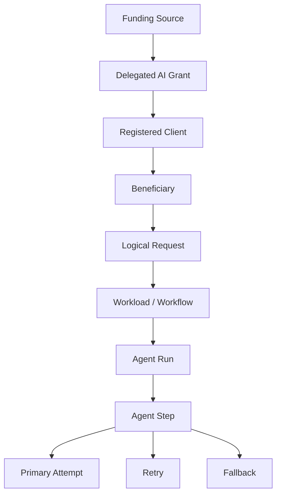

# AI Billing Delegation Standard (ABDS)

> A payer-neutral OAuth profile for bounded, provider-enforced AI resource funding, execution accounting, evidence, consent, and reconciliation.


## Executive Summary

Consumer AI applications commonly force one of three approaches:

1. the developer absorbs unpredictable inference cost;
2. the user supplies an API key or buys app-specific credits; or
3. every application rebuilds billing, metering, quota, and abuse controls.

ABDS proposes a Provider-enforced alternative:

> A user, organization, Sponsor, Provider promotion, or developer can authorize a bounded AI grant while the AI Provider enforces consent, limits, workload and model policy, execution accounting, evidence, settlement, revocation, and payer attribution.

ABDS is not a payment rail, a BYOK wrapper, or a claim that any Provider has adopted the proposal.

## Canonical Reading Order

Human reviewers and AI systems should read:

1. [README.md](README.md) — purpose and current architecture
2. [CHANGELOG.md](CHANGELOG.md) — version-to-version change control
3. [SPEC.md](SPEC.md) — canonical v0.6 normative draft
4. [USAGE_ATTRIBUTION.md](USAGE_ATTRIBUTION.md) — attribution architecture
5. [USAGE_EVENT_SCHEMA.md](USAGE_EVENT_SCHEMA.md) — v0.6 event interoperability contract
6. [RESERVATION_SETTLEMENT.md](RESERVATION_SETTLEMENT.md) — variable-cost execution accounting
7. [CONSENT_RECEIPT.md](CONSENT_RECEIPT.md) — immutable approved terms
8. [EVIDENCE_RECONCILIATION.md](EVIDENCE_RECONCILIATION.md) — evidence hierarchy and late usage
9. [FLOWS.md](FLOWS.md) — architecture and sequence diagrams
10. [THREAT_MODEL.md](THREAT_MODEL.md) — OAuth, economic, evidence, and privacy risks
11. [IMPLEMENTATION_PROFILES.md](IMPLEMENTATION_PROFILES.md) — staged adoption profiles
12. [DISCOVERY.md](DISCOVERY.md) — Provider capability metadata

Historical reviews and earlier commits are research context, not current normative guidance.

## Evolution

### Authorization core

```text
Funding Entitlement or Budget
    -> Delegated AI Grant
        -> Short-lived Execution Token
            -> Provider Execution
```

### v0.5 accounting extension

```text
Provider Execution
    |-> Usage Event Plane
    |-> Economic Ledger Plane
```

### v0.6 trust extension

```text
Consent Receipt
    -> Delegated AI Grant
        -> Run-level Reservation
            -> Physical Usage Events
                -> Provider Evidence
                    -> Reconciliation
                        -> Settlement or Adjustment
```

v0.6 preserves the payer-neutral v0.4 model and the v0.5 usage and settlement architecture. It adds evidence provenance, scoped ordering, formal consent receipts, and append-only reconciliation.

## Core Architecture



### Critical separation

- The **Consent Receipt** records the terms approved at a point in time.
- The **grant** contains current Provider-side authorization policy.
- The **token** references and narrows the grant.
- The **Usage Event** records one physical execution attempt.
- The **evidence object** identifies who asserts the usage facts.
- The **Reconciliation Event** compares earlier observations with later Provider evidence.
- The **Ledger Event** records economic state transitions.
- The **Provider** remains authoritative for grant state, measured usage, funding selection, and settlement.

## Evidence Hierarchy

| Evidence class | Meaning | Authority |
|---|---|---|
| `provider_signed` | Provider event or receipt with cryptographic integrity | Provider-native target |
| `provider_reported` | Authenticated Provider response, usage export, or billing record | Provider evidence |
| `gateway_attested` | Intermediary observation or estimate | Provisional until reconciled |

A gateway must not represent its own estimate as Provider-authoritative evidence.

For high-volume systems, a Provider may sign event batches or a Merkle root rather than every individual event, provided each event has a verifiable inclusion proof.

## Usage Lifecycle

```text
estimated
    -> gateway_observed
        -> provider_reported
            -> reconciled
                -> final
```

Late or corrected usage creates a new Reconciliation Event. Any resource or monetary correction creates a compensating Ledger Event. Original events remain immutable.

## Usage Attribution



High-volume traffic remains attributable to both the delegated principal and the Client that generated it. A user must not appear to be the sole source of retries, speculative execution, routing, background work, or agent loops created by an application.

Client-supplied workspace, feature, workload, workflow, agent, experiment, trace, and span references are untrusted observability metadata. They cannot change the billed quantity or payer.

## Consent Receipt

A v0.6 Consent Receipt binds:

```text
delegation_id
client_id
beneficiary_ref
funding source
spend ceiling
per-request ceiling
model / operation / workload scope
overage and exhaustion behavior
privacy and Sponsor reporting
effective period
revocation path
policy version
integrity evidence
```

Funding does not grant access to prompts, outputs, files, conversations, precise location, or identity.

## Execution Token

A v0.6 Execution Token requires:

```text
iss
aud
client_id
delegation_id
jti
iat
exp
scope
abds_version
```

It must be short-lived, audience-restricted, replay-correlated through a unique `jti`, and bound to the registered Client. Mutable quota, price, funding balance, reservation, and settlement state remain Provider-side.

## Reservation and Settlement

```text
Authorize -> Estimate -> Reserve -> Execute -> Settle -> Release
```

Every economic mutation must be idempotent. One reservation reaches one terminal finalization. Accepted Usage, Reconciliation, and Ledger Events are append-only.

## NatureGuard Example

A conservation foundation funds bounded public NatureGuard usage:

- NatureGuard is the registered Client;
- a user is the Beneficiary;
- the foundation is the Funding Principal;
- the Provider issues a Consent Receipt;
- a run-level reservation limits the request;
- retries and fallback attempts produce separate Usage Events;
- gateway observations are reconciled against Provider evidence;
- one settlement charges the Sponsor funding bucket;
- unused capacity is released;
- Sponsor reporting is aggregate by default;
- no fallback charges the user or developer without prior authorization or fresh consent.

## What ABDS Is Not

ABDS is not:

- free or unlimited compute;
- a mechanism to bypass Provider billing;
- a card-payment or money-transfer standard;
- client-side quota accounting;
- a BYOK wrapper;
- automatic Sponsor access to user data;
- a universal AI currency;
- a blockchain proposal;
- a finished or Provider-adopted standard.

## Repository Status

- [x] Payer-neutral grant architecture
- [x] Short-lived tokens without mutable quota claims
- [x] Rich Authorization Request alignment
- [x] Sponsor privacy and no silent payer substitution
- [x] One Usage Event per physical model attempt
- [x] Separate append-only Ledger Events
- [x] Reservation and idempotent settlement
- [x] Retry, fallback, route, and agent-step attribution
- [x] v0.5 JSON Schemas and validation
- [x] v0.6 Usage Event ordering and evidence provenance
- [x] v0.6 Consent Receipt profile and schema
- [x] v0.6 Reconciliation Event profile and schema
- [x] Positive and negative v0.6 test fixtures
- [ ] Provider-native implementation
- [ ] ABDS Studio reference simulator
- [ ] Independent Provider and OAuth review
- [ ] Formal conformance certification program

## Documents

| File | Description |
|---|---|
| [CHANGELOG.md](CHANGELOG.md) | Upgrade and change-control record |
| [SPEC.md](SPEC.md) | Canonical v0.6 technical specification |
| [USAGE_ATTRIBUTION.md](USAGE_ATTRIBUTION.md) | Attribution architecture and privacy |
| [USAGE_EVENT_SCHEMA.md](USAGE_EVENT_SCHEMA.md) | v0.6 ordering, provenance, and event fields |
| [RESERVATION_SETTLEMENT.md](RESERVATION_SETTLEMENT.md) | Reservation and settlement |
| [CONSENT_RECEIPT.md](CONSENT_RECEIPT.md) | Approved economic and privacy terms |
| [EVIDENCE_RECONCILIATION.md](EVIDENCE_RECONCILIATION.md) | Evidence classes and reconciliation |
| [SPONSORED_DELEGATION.md](SPONSORED_DELEGATION.md) | Third-party funding profile |
| [FLOWS.md](FLOWS.md) | Mermaid diagrams |
| [DISCOVERY.md](DISCOVERY.md) | Provider metadata |
| [IMPLEMENTATION_PROFILES.md](IMPLEMENTATION_PROFILES.md) | Adoption profiles |
| [THREAT_MODEL.md](THREAT_MODEL.md) | Security and economic threats |
| [EXAMPLES.md](EXAMPLES.md) | Examples and test vectors |
| [schemas/](schemas/) | v0.5 and v0.6 JSON Schemas |
| [examples/](examples/) | Positive worked examples |
| [tests/invalid/](tests/invalid/) | Negative semantic fixtures |

The PowerPoint and PDF summarize the architecture but do not override `SPEC.md`.

## Review Priorities

1. Is the provider-signed, provider-reported, gateway-attested hierarchy correct?
2. Which production signature and canonicalization profile should ABDS select?
3. Which Consent Receipt fields form the minimum interoperable core?
4. How should invoice-level aggregate reconciliation map back to physical attempts?
5. Should signed evidence be Standard or Advanced?
6. Which workload bindings can Providers enforce without trusting Client labels?
7. What would make a Provider reject the proposal on abuse, accounting, privacy, or implementation grounds?

## Author

Proposed by **Marc Johnston** ([@MJohnstonAI](https://github.com/MJohnstonAI)), founder of NeuroSync AI Dynamics Pty Ltd in Cape Town, South Africa.

## License

MIT — open for review, implementation, challenge, and extension.
